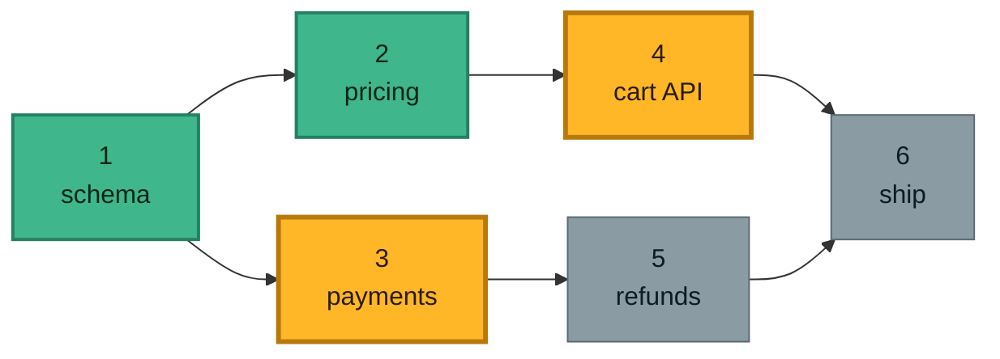
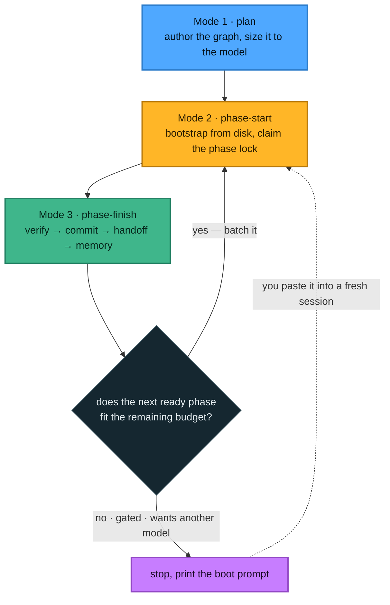
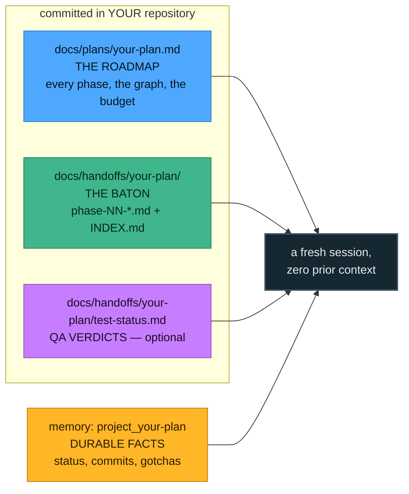
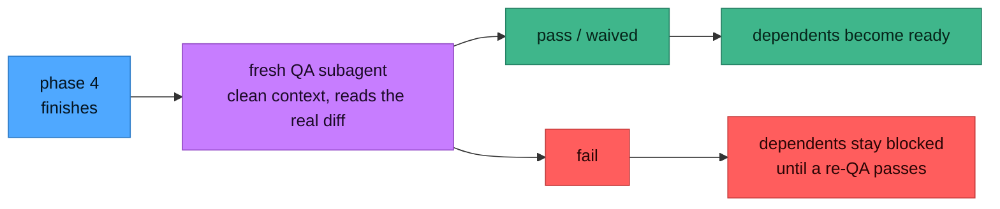

<div align="center">

# 🪜 phased-execution

**یک اسکیلِ [Claude Code](https://claude.com/claude-code) برای اجرای کارهایی که در یک نشست جا نمی‌شوند —
به‌شکلِ یک گرافِ وابستگی از نشست‌های هم‌اندازه، به‌همراهِ یک کنسولِ وبِ محلی برای تماشای آن.**


[English](README.md) · **فارسی**

</div>

```
Phase graph — checkout-rewrite   (4/9 done)

  ✅  1  done         Schema + migrations · QA:verified
  ✅  2  done         Pricing service · QA:verified
  ✅  3  done         Payment adapter · QA:verified
  ✅  4  done         Webhook ingest · QA:verified
  🔓  5  ready        Cart API
  🔓  6  ready        Refund worker
  ⏳  7  waiting      Checkout UI
  ⏳  8  waiting      Receipts + email
  ⏳  9  waiting      Ship (GATED) 🔒GATED needs: 7, 8

READY NOW:   5 6
WAITING:     7(←5), 8(←6), 9(←7,8)
SUGGESTED BATCHES (budget ~200K, joined phases share a session): [5 6]  [7 8]  [9]
```

<div dir="rtl">

*همین تابلو، خودِ محصول است. هیچ‌جای این سیستم «الان روی کدام فازم؟» را ذخیره نمی‌کند — این تابلو هر بار
از روی جدولِ وابستگیِ طرحِ شما و فایل‌های هندآفِ روی دیسک محاسبه می‌شود.*

---

## فهرست

**شروع کار** — [نصب](#install) · [چه مشکلی را حل می‌کند](#problem) ·
[ایده در یک تصویر](#picture) · [اولین طرحِ شما، گام‌به‌گام](#first-plan)

**درکِ آن** — [حلقه‌ی کاری](#the-loop) · [مصنوعات](#artifacts)

**راندنِ آن** — [چیزهایی که کنترل می‌کنید](#control) · [مدیریتِ مدل](#model-handling) ·
[گیتِ QA](#qa-gating) · [نرده‌های محافظ](#safety)

**مرجع** — [Phase Console](#console) · [رسیدن به آن از روی گوشی](#phone) ·
[مرجعِ دستورها](#commands) · [اسکیل‌ها چطور کار می‌کنند](#skills-how) ·
[پیش‌نیازها و تست‌ها](#requirements)

---

<a id="install"></a>

## نصب

به [Claude Code](https://claude.com/claude-code) و **Node نسخه‌ی ‎22.6 یا بالاتر** نیاز دارید (Node فقط
برای کنسول لازم است؛ خودِ اسکیل با Bash خالی کار می‌کند). چیزِ دیگری لازم نیست — نه `npm install`، نه
مرحله‌ی build.

**یکی** از این دو مسیر را انتخاب کنید. هر دو دقیقاً همان اسکیل و همان کنسول را به شما می‌دهند.

### مسیر A — به‌شکلِ پلاگین *(پیشنهادی: یک خط، و خودش را به‌روز می‌کند)*

**پلاگین** بسته‌ای است که Claude Code برای شما نصب می‌کند. **مارکت‌پلیس** فهرستی است که پلاگین‌ها را
معرفی می‌کند. این مخزن هر دو تاست — یک کاتالوگ به‌نامِ `mobin` دارد که فقط یک پلاگین در آن است: خودش.
پس نصب، برای هرکدام یک دستور است.

**گام ۱.** Claude Code را در هر پروژه‌ای باز کنید و بنویسید:

</div>

```
/plugin marketplace add zsarir/phased-execution
```

<div dir="rtl">

Claude Code این مخزن را کلون می‌کند، کاتالوگِ داخلش را بررسی می‌کند و آن را با نامِ `mobin` به یاد
می‌سپارد. هنوز چیزی نصب نشده — یک مارکت‌پلیس فقط یک فهرست است.

**گام ۲.** پلاگین را از همان کاتالوگ نصب کنید:

</div>

```
/plugin install phased-execution@mobin
```

<div dir="rtl">

بخشِ `@mobin` می‌گوید از کدام کاتالوگ برداشته شود. وقتی چند کاتالوگ ثبت کرده باشید، این بخش اهمیت
پیدا می‌کند.

**گام ۳.** بارگذاری‌اش کنید:

</div>

```
/reload-plugins
```

<div dir="rtl">

یا فقط Claude Code را دوباره اجرا کنید. برای اطمینان از اینکه در فهرست آمده `/plugin` را بزنید — همان
صفحه یک تبِ **Errors** هم دارد اگر چیزی شکست خورده باشد.

**حالا چه چیزی دارید.** خودِ اسکیل، با نامِ `/phased-execution:phased-execution` — چون Claude Code
اسکیل‌های هر پلاگین را زیرِ نامِ همان پلاگین می‌گذارد تا دو پلاگین بتوانند هر دو یک اسکیلِ `review`
داشته باشند بدون تداخل. کافی است `/phased` را بزنید و بگذارید تکمیلِ خودکار بقیه‌اش را بنویسد. البته
به‌ندرت اصلاً تایپش می‌کنید: توضیحاتِ خودِ اسکیل آن‌قدر گویاست که Claude وقتی کار فازبندی‌شده باشد،
خودش سراغش می‌رود. یک دستورِ `phase-console` هم می‌گیرید که وب‌اپ را از هر پوشه‌ای بالا می‌آورد.

**به‌روز نگه‌داشتنش.** `/plugin update phased-execution`. این پلاگین عمداً هیچ شماره‌ی نسخه‌ای ندارد، که
آن را روی *کانالِ کامیت* می‌گذارد: هر پوش به `main` یک انتشارِ تازه حساب می‌شود، و Claude Code در
پس‌زمینه هم تازه‌سازی می‌کند. برای اعمالِ به‌روزرسانی، برنامه را دوباره اجرا کنید.

**حذفش.** `/plugin uninstall phased-execution@mobin`، و در صورت تمایل
`/plugin marketplace remove mobin`.

### مسیر B — به‌شکلِ یک پوشه‌ی ساده *(اگر می‌خواهید خودِ اسکیل را ویرایش کنید، یا روی مسیرش اسکریپت بنویسید)*

</div>

```bash
git clone https://github.com/zsarir/phased-execution.git ~/.claude/skills/phased-execution
```

<div dir="rtl">

Claude Code را دوباره اجرا کنید. اسکیل با نامِ `/phased-execution` در دسترس است — بدونِ پیشوند، چون
داخلِ یک پلاگین نیست. کنسول را با `~/.claude/skills/phased-execution/start` بالا بیاورید و با
`git pull` به‌روزش کنید.

### کدام مسیر؟

|  | پلاگین | کلون |
|---|---|---|
| **نصب** | دو دستور، داخلِ Claude Code | یک `git clone` |
| **به‌روزرسانی** | خودکار، با هر کامیت | هر وقت `git pull` بزنید |
| **نامِ اسکیل** | `/phased-execution:phased-execution` | `/phased-execution` |
| **کنسول** | `phase-console`، از هر جا | `./start`، از داخلِ پوشه |
| **کجا زندگی می‌کند** | یک پوشه‌ی کشِ نسخه‌دار که با هر به‌روزرسانی جابه‌جا می‌شود | هرجا که کلون کرده‌اید، برای همیشه |
| **مناسبِ** | اینکه همیشه حاضر و به‌روز باشد، بدونِ نگهداری | اسکریپت‌نوشتن روی مسیرش، یا ویرایشِ خودِ اسکیل |

هر دو با هم هم کار می‌کند، اما اسکیل را دو بار می‌بینید و هزینه‌ی همیشه-روشنِ آن را دو بار می‌پردازید.
یکی را انتخاب کنید.

</div>

<details dir="rtl">
<summary><b>نصب از ترمینال</b> — برای اسکریپت‌های dotfiles و ایمیج‌های کانتینر</summary>

<div dir="ltr">

```bash
claude plugin marketplace add zsarir/phased-execution
claude plugin install phased-execution@mobin
claude plugin details phased-execution@mobin      # components + token cost
claude plugin update phased-execution
claude plugin uninstall phased-execution@mobin
```

</div>

</details>

<div dir="rtl">

---

<a id="problem"></a>

## چه مشکلی را حل می‌کند

یک تغییرِ بزرگ در یک نشستِ Claude جا نمی‌شود. پس آن را تکه‌تکه می‌کنید — و بلافاصله بهایِ این تکه‌کردن را
دو بار می‌پردازید.

**نشست‌های طولانی می‌پوسند.** هرچه پنجره‌ی کانتکست پر می‌شود، حافظه و دقتِ مدل افت می‌کند. یک‌سومِ آخرِ یک
نشستِ خیلی طولانی، به‌شکلِ قابلِ اندازه‌گیری کارِ بدتری از یک‌سومِ اولش است. هیچ هشداری هم نمی‌گیرید؛ فقط
کدِ شلخته‌تری تحویل می‌گیرید.

**نشست‌های کوتاه به ارزِ دیگری گران‌اند.** هر نشستِ تازه باید دوباره جای پایش را پیدا کند: طرح را بخواند،
بخواند که نشستِ قبلی چه کرد، دوباره کد را کاوش کند. این راه‌اندازیِ اولیه یک مالیاتِ ثابت است، و
خُردکردنِ کار به نشست‌های ریز یعنی پرداختِ دوباره و دوباره‌ی آن. ضمناً کشِ پرامپت را هم دور می‌ریزد —
همان چیزی که یک نشستِ گرم را ارزان می‌کند.

</div>

```
    one long session   ███████████████████████████████████
                       └────────── quality decays in the tail ──────────┘

  many tiny sessions   ███▏███▏███▏███▏███▏███▏███▏███▏███
                       ▏ = a full bootstrap + closeout, paid every single time

         right-sized   ██████████▏██████████▏██████████
                       enough work to amortise ▏, few enough ▏ to stay sharp
```

<div dir="rtl">

**و رشته‌ی کار از دست‌تان در می‌رود.** وقتی کار روی ده‌ها نشست پخش شد، «تکه‌ی بعدی کدام است؟» دیگر بدیهی
نیست. ممکن است تکه‌ی ۷ آماده باشد در حالی که تکه‌های ۲ و ۳ هنوز باز‌اند. یادداشتی که می‌گوید *«الان روی
فاز ۵ هستیم»* همان لحظه‌ای که چیزی را خارج از ترتیب تمام کنید بی‌اعتبار می‌شود — و بعد روی پایه‌ای
می‌سازید که هرگز تمام نشده بود.

### سه اهرمِ واقعی

برخلافِ باورِ رایج که نشست‌های طولانی هزینه‌ی درجه‌دو دارند، Claude Code پیشوندِ گفت‌وگو را کش می‌کند، پس
یک نشستِ گرم تقریباً **خطی** با تعداد نوبت‌ها رشد می‌کند. چیزهایی که واقعاً ضرر می‌زنند این‌هاست:

| اهرم | چیست | این اسکیل با آن چه می‌کند |
|---|---|---|
| **پوسیدگیِ کانتکست** | با پرشدنِ پنجره کیفیت افت می‌کند — معمولاً خیلی زودتر از اینکه هزینه دردسر شود | هر نشست را به حدودِ ۶۰٪ پنجره اندازه می‌کند، تا هیچ نشستی وارد ناحیه‌ی بد نشود |
| **شکستنِ کش** | عوض‌کردنِ مدل، تغییرِ effort، زدنِ `/compact`، یا یک وقفه‌ی بیش از ۵ دقیقه — هرکدام یک بازخوانیِ تمام‌بها را تحمیل می‌کند | تعویضِ مدل را به یک مرزِ صریحِ نشست تبدیل می‌کند؛ و `/compact` وسطِ فاز را منع می‌کند |
| **مالیاتِ راه‌اندازی** | هر نشستِ تازه قبل از هر کاری باید طرح + هندآف + کد را بخواند | کارهای مجاور را در یک نشست دسته می‌کند تا این مالیات یک بار پرداخت شود، نه پنج بار |

---

<a id="picture"></a>

## ایده در یک تصویر

کار یک **گرافِ وابستگی** است، نه یک چک‌لیست. هر فاز اعلام می‌کند که کدام فازها باید قبل از شروعش تمام
شده باشند. بعد یک قانون همه‌چیز را تعیین می‌کند:

> **یک فاز وقتی `ready` است که شروع نشده باشد و *هر* وابستگی‌اش `done` باشد.**

آمادگی از روی *مجموعه‌ی* فازهای تمام‌شده محاسبه می‌شود — هرگز از روی یک شمارنده. همین یک انتخاب است که
پیشرفتِ خارج از ترتیب و انشعابی را امن می‌کند.

</div>



<div dir="rtl">

فازهای **۱** و **۲** تمام شده‌اند. همین باعث می‌شود **۳** آماده شود *(تنها وابستگی‌اش، یعنی ۱، تمام
شده)* و **۴** هم آماده شود *(تنها وابستگی‌اش، یعنی ۲، تمام شده)* — یک فازِ تمام‌شده، دو فاز را باز کرد.
فازهای **۵** و **۶** منتظر می‌مانند، چون یکی از وابستگی‌های هرکدام هنوز باز است.

دو نتیجه که ارزشِ درونی‌کردن دارند:

- **تمام‌کردنِ یک فاز می‌تواند چند فاز را باز کند.** آن‌ها همچنان **یکی‌یکی** اجرا می‌شوند — هرگز دو
  نشستِ Claude روی یک درختِ کاری — اما شما هرکدام را که خواستید انتخاب می‌کنید.
- **«تمام‌شده» یعنی همه‌ی فازها انجام شده‌اند**، نه «به بزرگ‌ترین شماره رسیدیم». می‌توانید ۱ → ۴ → ۶ را
  کامل کنید و تابلو همچنان، به‌درستی، ۳ و ۵ را ناتمام نشان می‌دهد.

---

<a id="first-plan"></a>

## اولین طرحِ شما، گام‌به‌گام

هیچ‌کدامِ این‌ها تشریفاتی نیست که خودتان دستی انجام دهید. شما با Claude حرف می‌زنید؛ اسکیل رویه را
می‌راند. این‌ها چیزی است که واقعاً اتفاق می‌افتد، تا بتوانید بازش بشناسید.

### گام ۱ — درخواستش کنید

در پروژه‌ی خودتان، به Claude بگویید چه می‌خواهید ساخته شود و اینکه باید فازبندی شود:

</div>

```
/phased-execution

I want to rewrite checkout: new schema, a pricing service, a payment adapter,
webhook ingest, cart API, refunds, the UI, receipts, and a ship step.
```

<div dir="rtl">

می‌توانید فقط کارِ بزرگ را توصیف کنید — اسکیل وقتی مناسب باشد خودش اعلامِ حضور می‌کند.

### گام ۲ — به یک سؤال درباره‌ی مدل جواب دهید

Claude می‌پرسد کدام مدل قرار است فازها را *اجرا* کند، چون همین تعیین می‌کند هر نشست چقدر بزرگ می‌تواند
باشد. اگر برایتان فرقی ندارد، همین را بگویید تا از یک پیش‌فرضِ منطقی استفاده کند. برای دیدنِ اینکه چه
چیزی تغییر می‌کند: [مدیریتِ مدل](#model-handling).

### گام ۳ — Claude طرح را می‌نویسد

فایلِ `docs/plans/checkout-rewrite.md` را در مخزنِ **خودِ شما** می‌سازد، شاملِ:

- اینکه چرا این کار وجود دارد و تصمیم‌های کلیدیِ طراحی
- یادداشتِ **`## Session budget`**: مدلِ هدف، بودجه‌ی هر نشست، شاخه، و هر گزینه‌ای که خواسته‌اید
- جدولِ **`## Phase graph`** — این همان بخشی است که ماشین می‌خوانَد، یک سطر برای هر فاز با وابستگی‌هایش
- یک بخشِ خودبسنده برای هر فاز: هدف، اندازه، فایل‌ها، گام‌ها، **معیارهای خروج**، **دستورهای راستی‌آزمایی**
- یک بخشِ راستی‌آزماییِ سرتاسری، برای وقتی که همه‌چیز تمام شد

بعد کارِ خودش را بررسی می‌کند:

</div>

```bash
scripts/phase-graph.sh checkout-rewrite        # does the board look right?
scripts/validate.sh checkout-rewrite           # malformed rows? undefined deps? cycles?
```

<div dir="rtl">

طرح را بخوانید. **این نقطه‌ی اصلیِ کنترلِ شماست** — یک فایلِ مارک‌داونِ معمولی است، و ویرایشش چیزی را که
بعداً اتفاق می‌افتد عوض می‌کند. هر چیزی که در [چیزهایی که کنترل می‌کنید](#control) آمده، یک خط در همین
فایل است.

### گام ۴ — Claude طرح را کامیت می‌کند و شروع به ساخت می‌کند

همان نشست بلافاصله فاز ۱ را پیاده‌سازی می‌کند — بدونِ راه‌اندازیِ سردِ بینِ طراحی و شروع، چون کانتکست از
قبل گرم است.

### گام ۵ — در پایانِ هر فاز

Claude یک چک‌لیستِ ثابت را به همین ترتیب اجرا می‌کند، و ترتیبش مهم است:

۱. **راستی‌آزمایی** — دستورهای راستی‌آزماییِ همان فاز را اجرا کن. همه سبز، وگرنه فاز با وضعیتِ `blocked`
   تحویل داده می‌شود. یک فازِ قرمز هرگز به‌عنوانِ کامل تحویل نمی‌شود.
۲. **کامیت** — با مسیرهای صریحِ فایل، هرگز `git add -A`.
۳. **نوشتنِ هندآف** — `docs/handoffs/checkout-rewrite/phase-01-schema.md`: چه چیزی عوض شد، کدام فایل‌ها،
   کدام تصمیم‌ها، و نشستِ بعدی به چه نیاز دارد. همین چیزی است که راه‌اندازیِ سرد را ممکن می‌کند.
۴. **به‌روزرسانیِ حافظه** — همان واقعیت‌های ماندگاری که باید از خودِ مستندات عمرِ بیشتری داشته باشند.
۵. **تصمیم: ادامه، یا توقف.**

### گام ۶ — ادامه یا توقف

اگر فازِ آماده‌ی بعدی در بودجه‌ی **باقی‌مانده‌ی** نشست جا شود، Claude همان‌جا واردش می‌شود — همان نشست،
کشِ گرم، بدونِ راه‌اندازیِ دوباره. این حالتِ پیش‌فرض و کارآمد است.

اگر بودجه تمام شده باشد (یا فازِ بعدی گیت‌شده باشد، یا مدلِ دیگری بخواهد)، متوقف می‌شود و یک
**بوت‌پرامپت** چاپ می‌کند: یک بلوکِ قابلِ کپی که فازِ بعدی را در یک نشستِ کاملاً تازه و بدونِ هیچ
پیش‌زمینه‌ای راه می‌اندازد. یک نشستِ تازه باز می‌کنید، می‌چسبانید، و کار دقیقاً از همان‌جا که مانده بود
ادامه پیدا می‌کند.

</div>

```
────────────────── START COPY ──────────────────
Continue plan `checkout-rewrite` — Phase 5 (Cart API).
Read docs/plans/checkout-rewrite.md §Phase 5 and
docs/handoffs/checkout-rewrite/phase-02-pricing.md first.
...
─────────────────── END COPY ───────────────────
```

<div dir="rtl">

### گام ۷ — هر وقت خواستید سر بزنید

</div>

```bash
scripts/phase-graph.sh checkout-rewrite      # the board
phase-console                                # or the whole thing in a browser
```

<div dir="rtl">

---
<a id="the-loop"></a>

## حلقه‌ی کاری

سه حالت. شما هیچ‌وقت اسمشان را نمی‌برید؛ Claude آن را که با موقعیت جور است انتخاب می‌کند و می‌گوید از
کدام استفاده می‌کند.

</div>



<div dir="rtl">

خاصیتِ مهم این است: **حالتِ ۲ فقط از روی دیسک راه می‌افتد.** یک نشستِ تازه، طرح و هندآفِ وابستگی‌ها و
ورودیِ حافظه را می‌خواند — و همین باید کافی باشد. اگر کافی نبود، یعنی هندآفِ قبلی ناقص بوده، و *همان*
باگی است که باید درست شود.

---

<a id="artifacts"></a>

## مصنوعات

چهار فایل، هرکدام با یک وظیفه. هیچ‌وقت همدیگر را تکرار نمی‌کنند، و همان `<slug>` مشترک به هم گره‌شان
می‌زند تا یک جست‌وجو همه‌شان را پیدا کند.

</div>



<div dir="rtl">

| مصنوع | کجا | تنها وظیفه‌اش |
|---|---|---|
| **طرح (Plan)** | `docs/plans/<slug>.md` | نقشه‌ی راهِ ماندگار: همه‌ی فازها، گرافِ وابستگی، جزئیاتِ هر فاز، معیارهای خروج. یک بار نوشته می‌شود، به‌ندرت ویرایش. |
| **هندآف (Handoff)** | `docs/handoffs/<slug>/phase-NN-*.md` + `INDEX.md` | چوبِ امدادی برای نشستِ سردِ *بعدی*: وضعیتِ الان، فایل‌های تغییریافته، تصمیم‌ها، دستورهای دقیقِ بعدی. در پایانِ هر فاز نوشته می‌شود. |
| **حافظه (Memory)** | `project_<slug>` در ایندکسِ حافظه‌ی شما | واقعیت‌های ماندگارِ بینِ نشست‌ها — وضعیت به‌شکلِ یک *مجموعه*، sha کامیت‌ها، گیت‌ها، نکته‌های غافلگیرکننده. |
| **وضعیتِ QA** *(اختیاری)* | `docs/handoffs/<slug>/test-status.md` + `reports/` | حکم‌های هر فاز که **فازهای وابسته را گیت می‌کنند**. تا QA را روشن نکنید اصلاً وجود ندارد. |

طرح‌ها و هندآف‌ها در **مخزنِ پروژه‌ی خودتان** زندگی می‌کنند، کامیت و پوش می‌شوند — تا هر ماشین یا هر
حسابی بتواند pull کند و ادامه دهد. خودِ اسکیل جداست؛ وضعیتِ کار هیچ‌وقت داخلِ پوشه‌ی اسکیل نمی‌رود.

---

<a id="control"></a>

## چیزهایی که کنترل می‌کنید

این همان بخشی است که بیشترِ آدم‌ها از دستش می‌دهند. طرح یک فایلِ مارک‌داونِ ساده است، و انگشت‌شمار خط از
آن **توسطِ موتور خوانده می‌شود**. یک خط را عوض کنید، رفتار عوض می‌شود. می‌توانید هرکدام از این‌ها را
موقعِ طراحی به زبانِ ساده از Claude بخواهید، یا بعداً خودتان فایل را ویرایش کنید.

### سطحِ کنترل، در یک نگاه

| می‌خواهید… | این را در طرح بگذارید | کجا |
|---|---|---|
| مدلِ اجراکننده را انتخاب کنید | `**Target model:** claude-opus-4-8` | `## Session budget` |
| اندازه‌ی کارِ هر نشست را عوض کنید | `**Budget:** ~200K weight/session` | `## Session budget` |
| برای یک فاز مدلِ دیگری بگذارید | `- **Model:** haiku` | همان بلوکِ `### Phase N` |
| اندازه‌ی یک فاز را اعلام کنید | `- **Size:** S` \| `M` \| `L` | همان بلوکِ `### Phase N` |
| QA را روشن کنید | `**QA gate:** on` | `## Session budget` |
| QA را صراحتاً خاموش کنید | `**QA gate:** off` | `## Session budget` |
| روی یک شاخه‌ی مشخص کامیت شود | `**Branch:** feature/checkout` | `## Session budget` |
| اسکیل‌هایی را به همه‌ی نشست‌ها تحمیل کنید | ``**Skills (every session):** `design-system` `` | `## Session budget` |
| بگویید یک فاز به بقیه وابسته است | ستونِ `Depends on` | جدولِ `## Phase graph` |
| یک فاز را پشتِ چیزی بیرونی ببندید | `*(GATED)*` + `- **Gates (must clear first):** …` | همان عنوانِ `### Phase N` |
| آن گیت را ماشین‌خوان کنید | `- **Gate-check:** date 2026-09-01` | همان بلوکِ `### Phase N` |

یک یادداشتِ کاملِ `## Session budget` این شکلی است:

</div>

```markdown
## Session budget

> **Target model:** `claude-opus-4-8` (1M window) · **Budget:** ~200K weight/session (≈60% of the
> window) · **Branch:** current branch (no new branch).
> **Skills (every session):** `design-system`, `some-plugin:test-first`
> **QA gate:** on
```

<div dir="rtl">

### ۱ · کدام مدل فازها را اجرا می‌کند

فازها معمولاً بعداً *اجرا* می‌شوند، در نشست‌های تازه، و شاید با مدلی غیر از مدلی که الان دارد طراحی
می‌کند. پس طرح یک «مدلِ هدف» را ثبت می‌کند، و هر شروعِ فاز آن را با مدلی که واقعاً در حالِ اجراست دوباره
می‌سنجد — اگر فرق داشتند، بودجه دوباره حساب می‌شود و دسته‌بندی عوض می‌شود. یک تقسیمِ رایج این است که یک
مدل طراحی کند و مدلِ دیگری اجرا کند.

### ۲ · چقدر کار در یک نشست جا می‌شود

**بودجه** با جمعِ *وزنِ* فازها اندازه‌گیری می‌شود، نه با کانتکستِ خام، و پیش‌فرضش **حدودِ ۰٫۲ برابرِ
پنجره‌ی مؤثرِ مدل** است. این باعث می‌شود یک نشستِ پر، نزدیکِ ۶۰٪ استفاده‌ی واقعی از پنجره بنشیند — دور از
فشرده‌سازیِ خودکار (حدودِ ۸۳٪) و دور از ناحیه‌ی افتِ کیفیت در انتهای پنجره. اگر پنجره‌ی مؤثرِ نشستِ شما از
حداکثرِ مدل کوچک‌تر است، بازنویسی‌اش کنید:

</div>

```bash
scripts/phase-graph.sh checkout-rewrite --session-plan 40000   # a raw budget in tokens
```

<div dir="rtl">

### ۳ · هر فاز چقدر بزرگ است

به یک فاز برچسب بزنید تا موتور بتواند فازها را برای شما در نشست‌ها گروه کند:

| برچسب | مجموعه‌ی کاری | شبیهِ چیست |
|---|---|---|
| `S` | تا حدودِ ‎15K توکن | یک ویرایشِ متمرکز، یک مایگریشن، یک فایلِ کوچک، یک سند |
| `M` *(پیش‌فرض)* | حدودِ ‎15–50K | یک قابلیتِ معمول روی چند فایل با کمی کاوش |
| `L` | حدودِ ‎50–120K | یک زیرسیستمِ قابلِ توجه، کاوشِ سنگین، دیف‌های بزرگ |

فازهای بدونِ برچسب `M` حساب می‌شوند. فازی که وزنش از بودجه‌ی یک نشست بیشتر شود، در واقع دو فاز است —
تقسیمش کنید.

### ۴ · اینکه فازها یک نشست را شریک شوند یا نه

</div>

```bash
scripts/phase-graph.sh checkout-rewrite --session-plan opus
```

<div dir="rtl">

فازهای *باقی‌مانده* را به ترتیبِ وابستگی می‌پیماید و تا وقتی هر وابستگی از قبل برآورده باشد و جمعِ وزن‌ها
در بودجه جا شود، آن‌ها را گروه می‌کند. همیشه سرِ فازهای گیت‌شده، سرِ وابستگی‌های برآورده‌نشده و سرِ مرزهای
QA برش می‌زند. این را یک پیشنهاد بدانید — Claude آن را با نشانگرِ زنده‌ی کانتکست تأیید می‌کند.

### ۵ · اینکه QA اجرا شود یا نه

پیش‌فرض خاموش. به [گیتِ QA](#qa-gating) نگاه کنید — این یک گیتِ واقعی است، نه یک گزارش، پس روشن‌کردنش
عوض می‌کند که کدام فازها اجازه‌ی شروع دارند.

### ۶ · کار روی کدام شاخه می‌نشیند

**پیش‌فرض: بدونِ شاخه‌ی جدید.** کار روی هر شاخه‌ای که همین الان checkout شده کامیت می‌شود، چون پخش‌کردنِ
یک طرح روی شاخه‌هایی که هرگز نخواسته‌اید، بدتر از این است. اگر *واقعاً* شاخه بخواهید، دقیقاً **یک** شاخه
کلِ طرح را حمل می‌کند — همه‌ی فازها، حتی فازهای مستقل در نشست‌های جدا — و طرح نامش را ثبت می‌کند تا هر
نشستِ سرد همان را checkout کند.

### ۷ · هر نشست از کدام اسکیل‌ها باید استفاده کند

اگر کارِ شما نیاز دارد یک اسکیلِ خاص به‌طورِ یکنواخت اعمال شود — یک اسکیلِ طراحی، یک اسکیلِ TDD —
نام‌بردنِ آن یک بار روی خطِ `Skills (every session):` یعنی موتور آن را دوباره به بوت‌پرامپتِ **هر** فاز و
به بریفِ QA تزریق می‌کند. نشست‌های سرد نمی‌توانند فراموشش کنند.

### ۸ · چه چیزی جلوی شروعِ یک فاز را می‌گیرد

فراتر از وابستگی‌ها، یک فاز می‌تواند روی چیزی بیرون از کد **گیت** شود — یک پنجره‌ی دیپلوی، یک تأیید،
مایگریشنِ یک نفرِ دیگر. از فازهای گیت‌شده هرگز در دسته‌بندی رد نمی‌شود. سه نوعِ ماشین‌خوان:

</div>

```markdown
- **Gate-check:** date 2026-09-01     # opens on that date
- **Gate-check:** phase 7            # clears when phase 7 is verified
- **Gate-check:** manual sign-off from ops
```

```bash
scripts/phase-graph.sh checkout-rewrite --gate-status 9    # exit 0 = clear, 1 = blocked
```

<div dir="rtl">

### ۹ · مستندات کجا زندگی می‌کنند

اسکریپت‌ها ریشه‌ی مخزنِ شما را خودکار پیدا می‌کنند، حتی از داخلِ یک submodule. هر وقت لازم شد
بازنویسی‌اش کنید:

</div>

```bash
DOCS_ROOT=/path/to/repo scripts/phase-graph.sh checkout-rewrite
```

<div dir="rtl">

---

<a id="model-handling"></a>

## مدیریتِ مدل

هر چیزی که به اندازه‌گیری مربوط است، از مدلی که اجرا می‌کنید سرچشمه می‌گیرد.

| مدل | پنجره | بودجه‌ی نشست *(وزنِ فاز)* | بهترین کاربرد |
|---|---|---|---|
| **Opus** ‎4.8 / 4.7 / 4.6 | 1M | **~200K** | اجراکننده‌ی پیش‌فرض؛ استدلالِ سخت و معماری |
| **Fable 5** | 1M | **~200K** | طراحی، و سخت‌ترین فازهای بلندافق |
| **Sonnet** ‎5 / 4.6 | 1M | **~200K** | فازهای پیاده‌سازیِ متعادل |
| **Haiku 4.5** | 200K | **~40K** | فازهای مکانیکی و ارزان — یعنی: فازهای کوچک‌تر، به تعدادِ بیشتر |
| *نامشخص / اعلام‌نشده* | — | **~40K** | فرض بر پنجره‌ی مؤثرِ ‎200K |

این اعداد در یک جا زندگی می‌کنند، [`scripts/sizing.env`](scripts/sizing.env)، که موتور مستقیم آن را
می‌خواند — پس مستندات و ابزار نمی‌توانند از هم فاصله بگیرند. برای تغییرِ سراسری، همان فایل را ویرایش
کنید.

**چرا وزن، و چرا ۰٫۲ برابر.** وزنِ یک فاز تخمینی است از مجموعه‌ی کاری‌ای که آن کار اضافه می‌کند —
خواندن‌های اولیه، فایل‌های بازشده، خروجیِ ابزارها، دیف‌ها. کانتکستِ واقعیِ نشست حدودِ **۳ برابرِ جمعِ
وزن‌ها** در می‌آید، وقتی پرامپتِ سیستمی و فکرکردن و رفت‌وبرگشتِ ابزارها و سربارِ گفت‌وگو رویش سوار
می‌شوند. پس بودجه‌ی ‎200K روی یک مدلِ ‎1M نزدیکِ ‎600K کانتکستِ واقعی می‌نشیند: حدودِ ۶۰٪ استفاده. پرکردنِ
پنجره تا ۱۰۰٪ دقیقاً به همین دلیل یک تله است — وزن‌ها واقعیت را سه‌برابر کمتر تخمین می‌زنند.

> ⚠️ **پنجره‌ی *مؤثر* خودتان را ببینید، نه حداکثرِ مدل را.** یک نشست می‌تواند حتی روی مدلی که ‎1M را
> پشتیبانی می‌کند، با پنجره‌ی ‎200K تنظیم شده باشد. بودجه ≈ ۰٫۲ × پنجره‌ای که واقعاً دارید.

**انتخابِ مدل برای هر فاز هم یک اهرم است.** استدلالِ سخت روی Opus یا Fable، پیاده‌سازیِ متعادل روی
Sonnet، و تغییرِ نامِ گسترده و کدهای تکراری روی Haiku. یک نکته: عوض‌کردنِ مدل وسطِ نشست کشِ پرامپت را دور
می‌ریزد، پس در هر نشست یک مدل نگه دارید — تعویضِ عمدیِ مدل یکی از معدود چیزهایی است که *مرزِ نشست را
توجیه می‌کند*.

**سبک نگه‌داشتنِ نشست** بودجه را کِش می‌آورد: جست‌وجوی گسترده در کد و کاوشِ چندفایلی را به ساب‌ایجنت‌هایی
بسپارید که زیاد می‌خوانند و یک خلاصه‌ی کوتاه برمی‌گردانند، تا آن توکن‌ها اصلاً واردِ نشستِ فاز نشوند. اما
زیاده‌روی نکنید — خواندنِ یک فایلِ تکی مستقیم سریع‌تر است.

---

<a id="qa-gating"></a>

## گیتِ QA

QA اینجا گزارشی نیست که بعداً بخوانید. یک **گیت** است: وقتی روشن باشد، فازهای وابسته به یک فاز اجازه‌ی
شروع ندارند تا وقتی آن فاز راستی‌آزمایی شود. کلِ هدف همین است — یک فازِ خراب نباید بی‌سروصدا به هر چیزی
که رویش ساخته می‌شود سرایت کند.

</div>



<div dir="rtl">

**روشن‌کردنش.** موقعِ طراحی بخواهیدش تا طرح خطِ `**QA gate:** on` را ثبت کند. بعداً هم بخواهید، پایانِ
فازِ بعدی آن را برمی‌دارد. برای دیدنِ اینکه یک طرح در کدام رژیم است:

</div>

```bash
scripts/phase-graph.sh checkout-rewrite --qa-mode      # off | on <reason> | waived <reason>
```

<div dir="rtl">

**چرا یک ساب‌ایجنتِ *تازه*.** نشستی که فاز را ساخته، همان نقاطِ کورِ کدی را دارد که تازه نوشته است. QA در
یک ساب‌ایجنت با کانتکستِ تمیز اجرا می‌شود که دیفِ واقعی را سرد می‌خواند — کامیت‌ها را با `git show`
راستی‌آزمایی می‌کند نه با اعتماد به خلاصه‌ی هندآف، هر معیارِ خروج را بررسی می‌کند، دنبالِ درستی و
حالت‌های مرزی و مدیریتِ خطا و رگرسیون و امنیت می‌گردد، و تست‌ها را اجرا می‌کند. مجموعه‌تستی که سبز است
اما واقعاً معیارها را پوشش نمی‌دهد، **fail** است نه pass.

**حکم‌ها.**

| حکم | معنی | اثر روی فازهای وابسته |
|---|---|---|
| `pass` | هر معیارِ خروج با شواهد برآورده شده، تست‌ها سبز، بدونِ یافته‌ی مهم/بحرانی | آزاد می‌شوند |
| `fail` | یک معیار برآورده نشده، یک یافته‌ی مهم/بحرانی، یا تست‌های قرمز | **نگه داشته می‌شوند** تا QA دوباره پاس شود |
| `waived` | واقعاً موضوعیت ندارد، با توجیهِ صریح | آزاد می‌شوند |
| `pending` | ثبت شده اما هنوز داوری نشده | نگه داشته می‌شوند |

وقتی حکم fail باشد، ساب‌ایجنتِ QA کد را **درست نمی‌کند** — حکم را برمی‌گرداند و کارهای بعدی را فهرست
می‌کند. اصلاح برعهده‌ی نشستی است که فاز را تمام می‌کند، و QA مجدد همیشه یک ساب‌ایجنتِ *تازه‌ی* دیگر است،
هرگز اجرای دوباره داخلِ همانی که رد کرده بود. نتایج کامیت و پوش می‌شوند تا گیت به همه‌ی کلون‌ها برسد.

حکم‌ها فقط از راهِ `scripts/qa-record.sh` ثبت می‌شوند — یک upsert که تکرارپذیر است. هرگز `test-status.md`
را دستی ویرایش نکنید.

---

<a id="safety"></a>

## نرده‌های محافظ

چیزهایی که جلوی آسیب‌زدنِ سیستم به شما را می‌گیرند، و همه‌شان مکانیکی‌اند.

**قفلِ فاز.** شروعِ یک فاز آن را claim می‌کند — یک فایلِ قفلِ کوچک در مخزنِ شما که ثبت می‌کند چه کسی آن را
در دست دارد، به‌همراهِ یک اجاره که خودش منقضی می‌شود. اگر نشستِ دومی ببیند فاز در دستِ یک نشستِ زنده است،
می‌ایستد و می‌پرسد، به‌جای اینکه همان فاز را دو بار بسازد. قفل‌ها کامیت می‌شوند، پس بینِ ماشین‌ها و
حساب‌ها کار می‌کنند.

**هر درختِ کاری، یک نشست.** فازها حتی وقتی چندتایشان آماده‌اند، پشتِ سرِ هم اجرا می‌شوند. دو نشستِ Claude
در یک پوشه وسطِ ویرایش روی هم می‌نویسند و شکستِ تست‌هایی تولید می‌کنند که هیچ‌کس نمی‌تواند توضیحش دهد.
موازی‌سازیِ واقعی می‌خواهید؟ به هر نشست checkout یا `git worktree` خودش را بدهید — هرگز یک پوشه را شریک
نکنید.

**برای تحویل، هرگز stash نکنید.** یک `git stash` فقط در یک درختِ کاری زندگی می‌کند و برای هر نشست و هر
کلونِ دیگری نامرئی است. به‌جایش کامیت کنید — حتی یک کامیتِ WIP. فایل‌سیستمِ یک نشستِ بسته‌شده یک کانال
نیست؛ git هست.

**راستی‌آزمایی پیش از تحویل.** دستورهای راستی‌آزماییِ خودِ فاز باید سبز باشند تا فاز به‌عنوانِ کامل تحویل
شود. کارِ قرمز با وضعیتِ `blocked` تحویل می‌شود و خطا ثبت می‌شود، تا تابلو حقیقت را نشان دهد.

**اعتبارسنجیِ ساختاری.** دستورِ `scripts/validate.sh <slug>` سطرهای بدشکلِ گراف، وابستگی به فازهایی که
وجود ندارند، دور (cycle)، وضعیت‌های نامعتبرِ هندآف، بخش‌های الزامیِ غایب، و هندآف‌هایی که وابستگیِ
اعلام‌شده‌شان با طرح نمی‌خواند را می‌گیرد. قبل از اعتماد به یک تابلو اجرایش کنید.

**کامیت با مسیرِ صریح.** هرگز `git add -A` — هر فاز فایل‌هایی را که دست زده کامیت می‌کند، تا کارِ
بی‌ربطِ داخلِ درختِ شما با خودش نبرد.

---

<a id="console"></a>

## 🚉 Phase Console

> *کلِ کتابخانه‌ی طرح‌ها در یک صفحه.*

</div>

```bash
phase-console                      # installed as a plugin — from anywhere
./start                            # cloned — from the folder
./start ~/code/your-repo           # skip the picker
./start --allow-writes             # plus the guarded write verbs
./start --allow-run                # plus the autopilot
```

<div dir="rtl">

یک کتابخانه‌ی طرح از ترمینال بزرگ‌تر می‌شود: ده‌ها طرح، صدها فاز، صدها فایلِ هندآف — و موتور دقیقاً برای
یک طرح در هر لحظه جواب می‌دهد. کنسول، نمایِ سبدِ کارهاست: چه چیزی **همین الان** در سراسرِ همه‌ی طرح‌ها
آماده است، کدام قفل چه چیزی را نگه داشته، کدام طرح گیر کرده، چقدر کار مانده، و اینکه آیا گرافِ یک طرح
اصلاً lint می‌شود یا نه.

| صفحه | محتوا |
|---|---|
| **Source** | هر مخزنی که `docs/plans` دارد. انتخاب‌های اخیر ذخیره می‌شوند؛ هر لحظه از ستونِ کناری قابل تعویض‌اند. |
| **Plans** | همه‌ی طرح‌ها با پیشرفت، فازهای آماده، قفل‌ها، رژیم QA و سلامت. تازه‌ترین فعالیت اول؛ با فیلترِ وضعیت، آماده، قفل‌شده یا مخزن. |
| **Route** | طرح به‌شکلِ نقشه‌ی مترو — فازها ایستگاه‌اند، وابستگی‌ها ریل‌اند، و هر دسته‌ی پیشنهادیِ نشست، قطاری است که از ایستگاه‌هایش عبور می‌کند. |
| **Departures** | تابلوی وضعیت: حالت، اندازه، وابستگی‌ها، گیت‌ها، قفل‌ها و QA برای هر فاز. |
| **Phase** | هدف، «اول این‌ها را بخوان»، فایل‌ها، گام‌ها، معیارهای خروج، راستی‌آزمایی — به‌علاوه‌ی هندآفِ همان فاز، وضعیت گیت، قفل و **بوت‌پرامپتش**، آماده‌ی کپی. |
| **Handoffs** | هر هندآف با قراردادِ front-matter، متن و بوت‌پرامپت‌هایی که تولید کرده. |
| **Analysis** | مسیر بحرانی، گلوگاه، بهترین فازِ بعدی، وزن و تعداد نشستِ باقی‌مانده، خط زمانیِ اتمام، جدول QA، مشکلاتِ سلامت. |
| **Overview** | زمینه، معماری، بودجه‌ی نشست، جدول phase-graph، راستی‌آزماییِ سرتاسری و ورودیِ حافظه‌ی طرح. |
| **Ready now** | هر فازِ آماده در سراسرِ همه‌ی طرح‌ها، مرتب بر اساسِ اینکه چقدر کار را باز می‌کند. |
| **Statistics** | جمع کلِ سبد، سرعت پیشرفت، تقویمِ اتمام‌ها، ترکیبِ اندازه‌ها، مخازن، اسکیل‌ها، مدل‌های هدف، قفل‌ها و همه‌ی مشکلاتِ سلامت. |
| **Autopilot** | راندنِ یک طرح بدون حضور شما: یک `claude -p` برای هر فاز، کنسولِ زنده‌ی نشست، صفِ تأییدها، و کنترل‌های pause، stop، retry، skip یا اجرای فقط یک فاز. |
| **Search** | جست‌وجوی تمام‌متن در همه‌ی طرح‌ها و هندآف‌ها، گروه‌بندی‌شده بر اساس طرح. |

**خودش را به‌روز می‌کند**: یک watch روی `docs/` تغییرات را با server-sent events می‌فرستد، پس هندآفی که
یک نشستِ ایجنت می‌نویسد بدون رفرش ظاهر می‌شود.

**یک قانون بر کلِ طراحی حکومت می‌کند.** `phase-graph.sh` تنها منبعِ حقیقت است برای done / ready /
waiting، دسته‌بندیِ نشست‌ها، بوت‌پرامپت‌ها، رژیم QA و lint — کنسول برای هر ادعای وضعیتی به همان
اسکریپت‌ها shell out می‌کند و هیچ‌کدام را دوباره حساب نمی‌کند. پارسِ جاوااسکریپتی فقط چیزی را پوشش
می‌دهد که اسکریپت‌ها بیرون نمی‌دهند (متن‌ها، جزئیاتِ فاز، بدنه‌ی هندآف‌ها) به‌علاوه‌ی تحلیل‌هایی که ارائه
نمی‌دهند (مسیر بحرانی، ارزشِ بازکنندگی، سرعت پیشرفت). یک تستِ هم‌ترازی، تابلوی هر طرح را دوباره از روی آن
پارس می‌سازد و ادعا می‌کند با موتور یکی است، تا این دو خوانش نتوانند بی‌سروصدا از هم فاصله بگیرند.

**نوشتن‌ها پیش‌فرض خاموش‌اند.** با `--allow-writes` کنسول می‌تواند اسکلتِ یک طرح یا هندآف بسازد، نتیجه‌ی
QA ثبت کند و قفلِ فازها را مدیریت کند — هرکدام پشتِ دیالوگی که اول دقیقاً همان دستور را نشان می‌دهد.
سوییچِ `--git` هرگز پاس داده نمی‌شود، پس هیچ‌وقت کامیت یا پوش نمی‌کند. سرور روی `127.0.0.1` می‌نشیند، و
حتی وقتی از جای دیگری به آن می‌رسید هم همان‌جا می‌ماند — `--remote` یک پراکسیِ احرازِ هویت‌کننده جلوی
سوکتِ لوپ‌بک می‌گذارد، نه اینکه سوکتی روی شبکه باز کند.

**اجراها هم پیش‌فرض خاموش‌اند، پشتِ سوییچِ خودشان.** سوییچِ `--allow-run` **اتوپایلوت** را روشن می‌کند:
کنسول یک طرح را بدونِ حضورِ شما می‌راند، با یک پروسه‌ی `claude -p` برای هر فاز — پس «کانتکست را بین فازها
پاک کن» اصلاً نیاز به پیاده‌سازی ندارد؛ پروسه تمام می‌شود و کانتکستش را با خودش می‌برد. یک فاز فقط وقتی
جلو می‌رود که سه بررسیِ مستقل با هم موافق باشند: راستی‌آزماییِ خودِ طرح پاس شود، `validate.sh` همچنان پاس
باشد، و تابلو که *دوباره از روی دیسک* خوانده شده بگوید انجام شده. هیچ‌کس از خودِ نشست نمی‌پرسد که موفق
بوده یا نه. مدل و effort و اسکیل‌ها برای هر اجرا یا هر فاز انتخاب می‌شوند؛ و دستوری که از درختِ کاری
بیرون بزند یک **درخواستِ تأیید** می‌سازد و منتظرِ یک آدم می‌ماند. عمداً از `--allow-writes` جداست: یک
نوشتن اسکلتِ یک فایل را می‌سازد، اما یک اجرا ساعت‌ها مخزن را ویرایش می‌کند.

**روی گوشی هم اجرا می‌شود.** تماشای یک اجرا و جواب‌دادن به یک درخواستِ تأیید، دو چیزی هستند که نمی‌توانند
تا برگشتنِ شما پشتِ میز صبر کنند، پس کنسول را می‌شود از گوشی راند — روی شبکه‌ی خصوصیِ خودتان، بدونِ اینکه
چیزی روی اینترنت باز شود. راه‌اندازی: [رسیدن به آن از روی گوشی](#phone).

جزئیات: [viewer/README.fa.md](viewer/README.fa.md).

---
<a id="phone"></a>

## 📱 رسیدن به آن از روی گوشی

> *یک اجرای بدونِ ناظر برای این وجود دارد که شما دست از تماشا بردارید. این فقط وقتی جواب می‌دهد که آن اجرا هنوز بتواند به شما برسد.*

یک اجرا وقتی به یک آدم نیاز داشته باشد متوقف می‌شود — دستوری که به اختیارِ خودش انجامش نمی‌دهد، یا
بررسی‌ای که فقط شما می‌توانید بکنید. آن‌وقت یک **درخواستِ تأیید** می‌سازد و منتظر می‌ماند. اگر کنسول فقط
از روی همان صندلیِ جلویش در دسترس باشد، هر کدام از این مکث‌ها تا وقتی برگردید و بنشینید طول می‌کشد.

این بخش کنسول را طوری تنظیم می‌کند که بتوانید یک اجرا را تماشا کنید، به یک درخواستِ تأیید جواب دهید و
فازِ بعدی را شروع کنید — از روی گوشی، روی هر شبکه‌ای، بدونِ اینکه چیزی روی اینترنتِ عمومی قرار بگیرد.

حدودِ ده دقیقه طول می‌کشد، و بیشترش زدنِ دو کلید است.

### شکلِ کلیِ ماجرا

</div>

```
  your phone, anywhere                       your machine
  ────────────────────                       ────────────
  https://your-machine.your-tailnet.ts.net
        │
        │  encrypted, private network, no open ports
        ▼
  tailscaled ──────────── sets Tailscale-User-Login: you@example.com
        │
        │  http://127.0.0.1:4123
        ▼
  Phase Console ───────── still bound to loopback. It always was.
```

<div dir="rtl">

**کنسول هیچ پورتی روی هیچ شبکه‌ای باز نمی‌کند — نه قبل از این، نه بعد از این.** همچنان روی `127.0.0.1`
گوش می‌دهد، و چیزی که از قبل می‌داند شما کی هستید جلوی آن سوکت گذاشته می‌شود. [Tailscale Serve][ts-serve]
همان چیز است: TLS را terminate می‌کند، تماس‌گیرنده را در برابرِ شبکه‌ی خصوصیِ شما احراز می‌کند، و با
loginِ تماس‌گیرنده در یک هدر، درخواست را به loopback فوروارد می‌کند.

آن هدر کلِ داستانِ احرازِ هویت است، و *فقط به این دلیل* ارزشی دارد که کنسول روی loopback مانده است. اگر
روی یک اینترفیسِ شبکه گوش می‌داد، هر کسی که به آن می‌رسید می‌توانست خودش همان هدر را بفرستد. این خودِ
[توصیه‌ی Tailscale][ts-serve] است: *«بهترین کار این است که سرویس فقط روی localhost گوش دهد.»*

به یک حسابِ [Tailscale](https://tailscale.com) نیاز دارید. پلنِ رایگان برای این کار کاملاً کافی است.

### گام ۱ · سه چیز را برای tailnet خود روشن کنید

هر سه پیش‌فرض خاموش‌اند و هر سه لازم‌اند. دوتای اول در
[صفحه‌ی DNS کنسولِ ادمین](https://login.tailscale.com/admin/dns) هستند:

۱. **MagicDNS را روشن کنید.** این همان چیزی است که باعث می‌شود
   `your-machine.your-tailnet.ts.net` برای دستگاه‌های خودتان resolve شود. بدونِ آن باید یک آدرسِ IP
   تایپ کنید، و یک IP نمی‌تواند گواهی داشته باشد.
۲. **HTTPS Certificates را روشن کنید.** آن‌وقت Tailscale یک گواهیِ واقعی و موردِاعتمادِ عمومی برای آن
   نام صادر می‌کند. HTTPS به MagicDNS *نیاز دارد*، پس به همین ترتیب انجامشان دهید.
۳. **Serve را روشن کنید.** این یکی کلیدی ندارد که از قبل پیدایش کنید: اولین باری که `tailscale serve`
   را روی یک tailnet که هرگز از آن استفاده نکرده اجرا کنید، دستور یک لینکِ تأیید چاپ می‌کند که شناسه‌ی
   آن ماشین در آن است، و بعد **منتظر می‌ماند** به‌جای اینکه تمام شود. لینک را باز کنید، تأییدش کنید، و
   همان دستوری که قبلاً اجرا کرده‌اید خودش ادامه پیدا می‌کند. اگر ترجیح می‌دهید از قبل انجامش دهید،
   همین حالا دستورِ گام ۴ را اجرا کنید و روی چیزی که به شما می‌دهد کلیک کنید.

> **بدانید با چه چیزی موافقت می‌کنید.** هر گواهی روی وب در لاگِ عمومیِ Certificate Transparency ثبت
> می‌شود، پس روشن‌کردنِ این گزینه نامِ ماشینِ شما را عمومی می‌کند — مثلاً
> `your-machine.your-tailnet.ts.net`. **نام** عمومی می‌شود. خودِ ماشین نه: از اینترنت غیرقابلِ دسترس
> می‌ماند و هیچ‌چیزِ این کار پورتی باز نمی‌کند.

حالا که در کنسولِ ادمین هستید، در [صفحه‌ی Machines](https://login.tailscale.com/admin/machines)،
**انقضای کلید (key expiry) را برای این ماشین غیرفعال کنید.** کلیدهای node به‌صورت پیش‌فرض منقضی
می‌شوند، و وقتی منقضی شوند دسترسیِ از راه دور بدونِ هیچ هشدار و هیچ دلیلِ آشکاری قطع می‌شود.

### گام ۲ · گوشی را روی همان tailnet بیاورید

اپِ Tailscale را نصب کنید، با همان حساب وارد شوید، و — این یکی به‌راحتی از قلم می‌افتد — مطمئن شوید که
**«Use Tailscale DNS» روشن است** در تنظیماتِ اپ. همین است که به گوشی اجازه می‌دهد نامِ `.ts.net` را
resolve کند. بدونِ آن، آن نام اصلاً باز نمی‌شود و هیچ‌چیزِ دیگری در این راهنما کار نخواهد کرد.

روی ماشینِ خودتان `tailscale status` را ببینید؛ گوشی باید در فهرست باشد.

### گام ۳ · به کنسول بگویید چه کسی اجازه دارد بیاید

دو سوییچِ جدید. هیچ‌کدام آن چیزی را که سرور به آن bind می‌شود عوض نمی‌کند:

| سوییچ | معنی |
|---|---|
| `--remote <host>` | کنسول به این hostname هم جواب می‌دهد، که پشتِ یک پراکسیِ احرازِ هویت‌کننده است. قابل تکرار. |
| `--remote-user <login>` | یک login که اجازه دارد از آن راه بیاید. قابل تکرار، یا `PHASE_CONSOLE_REMOTE_USERS` به‌صورتِ فهرستِ جداشده با کاما. برای `--remote` **الزامی** است. |

</div>

```bash
./start --root ~/code/your-repo --allow-writes --allow-run \
        --remote your-machine.your-tailnet.ts.net \
        --remote-user you@example.com
```

<div dir="rtl">

از نامِ واقعیِ MagicDNS خودتان استفاده کنید — دستورِ `tailscale status --json` آن را به‌عنوانِ
`Self.DNSName` چاپ می‌کند — و همان loginی که با آن وارد شده‌اید.

سوییچِ `--remote` بدونِ `--remote-user` **اصلاً بالا نمی‌آید**. شروع‌شدن بدونِ فهرستِ مجاز کاملاً درست به
نظر می‌رسید و بی‌سروصدا همه‌ی افرادِ شبکه‌ی شما را راه می‌داد، پس این یک خطاست نه یک هشدار.

برای اینکه از ری‌استارت و logout جان سالم به در ببرد، آن را با همان سوییچ‌ها به‌عنوانِ launchd agent نصب
کنید — سوییچ‌ها مستقیم پاس داده می‌شوند:

</div>

```bash
./start --install-agent --root ~/code/your-repo --allow-writes --allow-run \
        --remote your-machine.your-tailnet.ts.net --remote-user you@example.com
./start --agent-status
```

<div dir="rtl">

### گام ۴ · پراکسی را جلویش بگذارید

</div>

```bash
tailscale serve --bg --https=443 http://127.0.0.1:4123
tailscale serve status          # confirm what is being served
```

<div dir="rtl">

**اولین اجرا روی tailnetی که هرگز از Serve استفاده نکرده، برنمی‌گردد.** پیامِ
*"Serve is not enabled on your tailnet"* را با یک لینکِ تأیید چاپ می‌کند و منتظر می‌ماند تا شما بازش
کنید. این همان موردِ گام ۱ است که از قبل نمی‌شود انجامش داد — تأییدش کنید و دستور خودش تمام می‌شود.
اجراهای بعدی بلافاصله برمی‌گردند.

**اگر می‌خواهید این ماندگار باشد، `--bg` اختیاری نیست.** با آن، Serve پایدار می‌شود: بعد از ری‌استارت و
بعد از `tailscale down` / `tailscale up` برمی‌گردد. بدونِ آن، Serve فقط تا وقتی زنده است که آن دستورِ
پیش‌زمینه زنده باشد، و تا ابد باید دستی دوباره اجرایش کنید.

برای برگرداندنش: `tailscale serve --https=443 http://127.0.0.1:4123 off`، یا `tailscale serve reset`
برای پاک‌کردنِ همه‌چیز.

حالا `https://your-machine.your-tailnet.ts.net/` را روی گوشی باز کنید. قفلِ سبز، بدونِ هشدار، بدونِ
شماره‌ی پورت.

### گام ۵ · روی Home Screen نصبش کنید

در Safari: **Share → Add to Home Screen**.

این تزئینی نیست. روی iOS، **نوتیفیکیشنِ وب فقط برای سایتی وجود دارد که روی Home Screen نصب شده باشد** —
در یک تبِ معمولیِ Safari اصلاً نمی‌شود آن دسترسی را درخواست کرد. و چون کلِ هدفِ در دسترس بودن همان
نوتیفیکیشن است، این نصب بخشی از راه‌اندازی است، نه یک تجملات.

بعد از نصب، از روی Home Screen بازش کنید و دسترسیِ نوتیفیکیشن را از دکمه‌ی داخلِ **Settings** بدهید.
هیچ‌وقت موقعِ باز شدنِ صفحه این دسترسی مطالبه نمی‌شود: صفحه‌ای که همان لحظه‌ی باز شدن می‌پرسد، از رویِ
غریزه رد می‌شود، و آن ردکردن دائمی است.

وقتی یک اجرا **متوقف** شود، وقتی **پارک** شود، وقتی **تمام** شود، و وقتی یک **درخواستِ تأیید** منتظر
باشد نوتیفیکیشن می‌گیرید — و عمداً برای تکِ تکِ فازها نه، چون کانالی که مدام زنگ می‌زند کانالی است که
یاد می‌گیرید نادیده‌اش بگیرید.

اندروید به هیچ‌کدامِ این‌ها نیاز ندارد — نوتیفیکیشن در یک تبِ عادیِ HTTPS کار می‌کند — اما نصب‌کردنش باز
هم پنجره‌ی تمیزتری به شما می‌دهد.

### گام ۶ · هشدار وقتی کنسول بسته است *(اختیاری)*

نوتیفیکیشنِ مرورگر فقط تا وقتی کار می‌کند که صفحه جایی باز باشد. برای یک هشدارِ واقعی روی صفحه‌ی قفل در
ساعت ۲ بامداد، `PHASE_CONSOLE_NOTIFY` را به یک اسکریپت وصل کنید. هر وقت اجرا به یک آدم نیاز داشته باشد،
به‌شکلِ `your-script "<title>" "<body>"` اجرا می‌شود:

</div>

```bash
#!/bin/sh
# ~/.local/bin/phase-notify
curl -s -H "Title: $1" -d "$2" https://ntfy.sh/your-private-topic-name >/dev/null
```

```bash
chmod +x ~/.local/bin/phase-notify
export PHASE_CONSOLE_NOTIFY=~/.local/bin/phase-notify   # or add it to the launchd agent's environment
```

<div dir="rtl">

سرویسِ [ntfy](https://ntfy.sh) کوتاه‌ترین راه است — اپش را نصب کنید و روی همان topic مشترک شوید.
Pushover و Slack و وبهوکِ خودتان هم دقیقاً به همین شکل کار می‌کنند.

> **این کار نامِ طرح‌ها و جزئیاتِ درخواست‌های تأیید را به هر سرویسی که انتخاب کنید می‌فرستد.** یک نامِ
> topic انتخاب کنید که کسی حدس نزند، و اگر کار حساس است [ntfy را خودتان
> میزبانی کنید](https://docs.ntfy.sh/install/) یا اسکریپت را به جایی بفرستید که خودتان کنترلش می‌کنید.
> اینکه این فقط یک متغیرِ محیطی است عمدی است — هیچ‌چیزی که از یک صفحه‌ی وب قابلِ دسترس باشد نباید
> انتخاب کند کدام دستور اجرا شود.

### واقعاً چه چیزی اعمال می‌شود

به‌محضِ اینکه یک hostname نام ببرید، بررسیِ سخت‌گیرانه‌ی `Host` روشن می‌شود و دقیقاً دو نوع درخواست سرو
می‌شود:

| درخواست | حکم |
|---|---|
| `Host` لوپ‌بک، بدونِ هدرِ هویت | **سرو می‌شود.** خودِ شما، پشتِ همین ماشین — بدونِ تغییر نسبت به قبل. |
| hostname مربوط به `--remote` + یک loginِ مجاز | **سرو می‌شود.** خودِ شما، از راهِ پراکسی. |
| hostname مربوط به `--remote`، بدونِ هدرِ هویت | **403.** چیزی بدونِ عبور از پراکسی به کنسول رسیده است. |
| hostname مربوط به `--remote`، با loginی که در فهرست نیست | **403.** یک نفرِ دیگر در شبکه‌ی شما. |
| هر `Host` دیگری | **421.** این همان چیزی است که یک صفحه‌ی DNS-rebinding با آن می‌آید. |
| `Host` لوپ‌بک که هدرِ هویت **همراهش هست** | **421.** توضیحش پایین. |

آن سطرِ آخر واقعاً کار می‌کند و ارزشِ فهمیدن دارد. هر کسی در شبکه‌ی خصوصیِ شما می‌تواند هرچه بخواهد در
هدرِ `Host` بگذارد — از جمله `127.0.0.1`. اگر `Host` لوپ‌بک به‌تنهایی معنیِ «محلی» می‌داد، چنین
درخواستی بررسیِ هویت را کاملاً دور می‌زد. اما نمی‌تواند: پراکسی روی هر چیزی که فوروارد می‌کند هدرِ هویت
می‌گذارد، پس یک `Host` لوپ‌بک که *همراهِ* آن هدر برسد، ترکیبی است که هیچ کلاینتِ صادقی تولید نمی‌کند.

می‌توانید همه‌اش را خودتان، از روی همان ماشین و بدونِ گوشی، بررسی کنید:

</div>

```bash
C=http://127.0.0.1:4123
H=your-machine.your-tailnet.ts.net
curl -s -o /dev/null -w '%{http_code}\n' $C/api/state                                        # 200
curl -s -o /dev/null -w '%{http_code}\n' -H "Host: evil.example"  $C/api/state               # 421
curl -s -o /dev/null -w '%{http_code}\n' -H "Host: $H"            $C/api/state               # 403
curl -s -o /dev/null -w '%{http_code}\n' -H "Host: $H" -H "Tailscale-User-Login: you@example.com" $C/api/state   # 200
```

<div dir="rtl">

از `curl` استفاده کنید، نه از یک `fetch()` در کنسولِ مرورگر — آنجا `Host` یک هدرِ ممنوعه است، پس
بی‌سروصدا حذف می‌شود و همه‌ی حالت‌ها شبیهِ «قبول» به نظر می‌رسند.

### محکم‌ترکردنش *(اختیاری)*

Serve هم مثل هر چیزِ دیگری روی tailnet از قوانینِ دسترسیِ شما تبعیت می‌کند. اگر بیش از یک نفر یا یک
ماشین روی tailnet شما هست، محدودش کنید. در
[access controls](https://login.tailscale.com/admin/acls):

</div>

```jsonc
{
  "grants": [
    { "src": ["autogroup:owner"], "dst": ["autogroup:self"], "ip": ["tcp:443"] }
  ]
}
```

<div dir="rtl">

حذف‌کردنِ ماشین‌هایی که دیگر استفاده نمی‌کنید هم ارزشش را دارد. آن‌ها تنها دستگاه‌هایی هستند که اصلاً
می‌توانند به کنسول برسند.

### چه کارهایی نکنید

- **به‌جای این از `--host 0.0.0.0` استفاده نکنید.** این کار کنسول را — که با `--allow-run` نشست‌هایی
  می‌سازد که مخزنِ شما را ویرایش می‌کنند — روی هر شبکه‌ای که به آن وصل شوید می‌گذارد، بدونِ هیچ احرازِ
  هویتی. ضمناً هوکِ تأیید را هم می‌شکند: آدرسی که نشست‌های فرزند برای callback استفاده می‌کنند از آدرسِ
  bind گرفته می‌شود، و آن هوک **fail-open** است، پس لیستِ ask **بی‌سروصدا** از کار می‌افتد و هر نشست
  فقط با قوانینِ deny اجرا می‌شود.
- **از `tailscale funnel` استفاده نکنید.** Funnel خواهرِ عمومیِ Serve است: روی کلِ اینترنت منتشر می‌کند.
  هر چیزی که بالا گفته شد به این وابسته است که تماس‌گیرنده کسی باشد که شبکه‌ی شما قبلاً او را تأیید
  کرده است.
- **از HTTPS صرف‌نظر نکنید.** HTTP ساده روی یک hostname یک [secure context] نیست، پس نوتیفیکیشن در
  دسترس نخواهد بود و نصب روی Home Screen ناقص می‌شود. تونل در هر دو حالت رمزنگاری‌شده است — بحث بر سرِ
  این است که مرورگر به آن صفحه اجازه‌ی چه کاری می‌دهد.

### وقتی کار نمی‌کند

| نشانه | علت |
|---|---|
| نام روی گوشی resolve نمی‌شود | MagicDNS در کنسولِ ادمین خاموش است، یا **«Use Tailscale DNS»** در اپِ Tailscale گوشی خاموش است. |
| `tailscale serve` پیامِ *"Serve is not enabled on your tailnet"* می‌دهد و هیچ‌وقت برنمی‌گردد | Serve یک قابلیتِ tailnet است که تا کسی تأییدش نکند خاموش است. لینکی را که دستور چاپ کرده باز کنید — مخصوصِ همان ماشین است — و تأییدش کنید. دستور دقیقاً منتظرِ همین است و خودش ادامه می‌دهد؛ آن را نکُشید. |
| `tailscale serve` درباره‌ی گواهی خطا می‌دهد | HTTPS Certificates روشن نیست. گام ۱. |
| **403** — *"No caller identity"* | مستقیم به کنسول رسیده‌اید نه از راهِ Serve، یا Serve اجرا نیست. `tailscale serve status` را ببینید. |
| **403** — *"… is not allowed to use this console"* | آن login واقعی است اما در `--remote-user` نیست. |
| **421** — *"does not answer to …"* | hostnameی که باز کرده‌اید همانی نیست که به `--remote` داده‌اید. باید دقیقاً یکی باشند. |
| **421** — *"arrived through a proxy but asks for a local hostname"* | چیزی هدرِ `Host` را به `localhost` بازنویسی کرده. Serve این کار را نمی‌کند؛ پراکسیِ دیگری در مسیر ممکن است بکند. |
| کنسول اصلاً بالا نمی‌آید | `--remote` بدونِ `--remote-user`. خودِ خطا همین را می‌گوید. |
| دکمه‌ی نوتیفیکیشن روی iOS هیچ کاری نمی‌کند | روی Home Screen نصب نشده، یا روی HTTP ساده هستید. هر دو لازم است. |
| دیروز کار می‌کرد، بعد از ری‌استارت مُرد | `tailscale serve` بدونِ `--bg` اجرا شده بود. |
| هفته‌ها کار کرد، بعد قطع شد | کلیدِ node ماشین منقضی شده. انقضای کلید را غیرفعال کنید (گام ۱). |
| روی وای‌فای کار می‌کند، روی دیتای موبایل نه | Tailscale روی گوشی خاموش شده، یا iOS پروفایلِ VPN آن را غیرفعال کرده. |

[ts-serve]: https://tailscale.com/docs/features/tailscale-serve
[secure context]: https://developer.mozilla.org/en-US/docs/Web/Security/Secure_Contexts

---

<a id="commands"></a>

## مرجعِ دستورها

این‌ها را از داخلِ مخزنی اجرا کنید که صاحبِ `docs/` است، یا `DOCS_ROOT` را تنظیم کنید.

### موتور

</div>

```bash
scripts/phase-graph.sh <slug>                    # the board (default)
scripts/phase-graph.sh <slug> --lint             # structural validation; non-zero on a problem
scripts/phase-graph.sh <slug> --ready            # ready phase numbers
scripts/phase-graph.sh <slug> --ready-after N    # the ready set assuming N just completed
scripts/phase-graph.sh <slug> --deps N           # N's prerequisites
scripts/phase-graph.sh <slug> --dependents N     # phases N blocks
scripts/phase-graph.sh <slug> --size N           # S | M | L
scripts/phase-graph.sh <slug> --gated N          # yes | no
scripts/phase-graph.sh <slug> --gate-status N    # evaluate the machine gate
scripts/phase-graph.sh <slug> --boot-prompt N    # the copy-paste prompt for phase N
scripts/phase-graph.sh <slug> --session-plan opus   # proposed session grouping
scripts/phase-graph.sh <slug> --qa-mode          # off | on <reason> | waived <reason>
scripts/phase-graph.sh <slug> --qa-result N      # the recorded verdict
scripts/phase-graph.sh <slug> --qa-prompt N      # the QA subagent's brief
scripts/phase-graph.sh <slug> --memory-block     # done/ready/waiting, for the memory entry
```

<div dir="rtl">

### اسکریپت‌های کمکی

| اسکریپت | چه کاری می‌کند |
|---|---|
| `new-plan.sh <slug>` | ساختِ اسکلتِ `docs/plans/<slug>.md` از روی قالب. |
| `new-handoff.sh <slug> <N> <title> [status] [--qa] [--force]` | ساختِ اسکلتِ هندآفِ فاز، به‌روزرسانیِ `INDEX.md`، پرکردنِ خودکارِ وابستگی‌ها و تولیدِ یک بوت‌پرامپت برای هر فازی که باز شده. |
| `handoff-status.sh <slug>` | ایندکس، وضعیتِ هر فایل، و تابلوی زنده. |
| `next-phase-prompt.sh <slug> <N\|none>` | بنرِ پایانِ فاز، تابلو، توصیه‌ی دسته‌بندی، و یک بوت‌پرامپت برای هر فازِ تازه‌آماده. |
| `phase-lock.sh <slug> claim\|release <N> --owner <id> [--force] [--git]` | گرفتن یا آزادکردنِ قفلِ یک فاز. |
| `qa-record.sh <slug> <N> <pass\|fail\|waived\|pending> --report <path>` | ثبتِ حکمِ QA. |
| `validate.sh <slug>` | اعتبارسنجیِ کامل — هم ساختارِ طرح و هم سازگاریِ هندآف‌ها. |

---

<a id="skills-how"></a>

## اسکیل‌های ایجنت چطور کار می‌کنند

یک [Skill](https://code.claude.com/docs/en/skills) پوشه‌ای است با یک `SKILL.md` که فقط front-matter آن
(`name` + `description`) *همیشه* بارگذاری می‌شود. Claude متنِ کاملش را **فقط وقتی می‌خواند که اسکیل
مرتبط باشد یا صدا زده شود**، و اسکریپت‌های همراهش از طریقِ Bash اجرا می‌شوند بدونِ اینکه کدشان هرگز واردِ
پنجره‌ی کانتکست شود. به همین دلیل است که یک اسکیل تا وقتی استفاده نشود تقریباً هیچ هزینه‌ای ندارد — این
یکی در هر نشست **حدودِ ۱۹۰ توکن** است، و فقط در نوبت‌هایی که واقعاً فعال می‌شود حدودِ ‎9K.

</div>

```
phased-execution/
├── SKILL.md          # frontmatter + the procedure Claude follows
├── USAGE.md          # human-facing orientation
├── start             # launch the console
├── bin/              # phase-console — the same launcher, on PATH for plugin installs
├── scripts/          # the engine and its helpers (run, don't read)
├── references/       # plan/handoff formats, conventions, sizing, QA method
├── templates/        # plan, handoff and INDEX scaffolds
├── tests/            # bats suite for the scripts
├── viewer/           # Phase Console — the local web app
└── .claude-plugin/   # marketplace.json — makes this repo installable as a plugin
```

<div dir="rtl">

عمداً هیچ `plugin.json` وجود ندارد. خودِ ورودیِ مارکت‌پلیس متادیتای پلاگین را حمل می‌کند
(`strict: false`)، و همین باعث می‌شود وقتی این را کلون می‌کنید یک اسکیلِ ساده باقی بماند — یک درخت، هر
دو مسیرِ نصب، بدونِ اینکه هیچ‌کدام مزاحمِ دیگری شود.

**▶ اینکه این حلقه دقیقاً چطور اجرا می‌شود:** [USAGE.fa.md](USAGE.fa.md).

<a id="requirements"></a>

## پیش‌نیازها

**Node نسخه‌ی ‎22.6 یا بالاتر** (برای کنسول — که TypeScript را مستقیم اجرا می‌کند، بدونِ مرحله‌ی build)
و **Bash** (برای اسکریپت‌ها). چیزِ دیگری لازم نیست. نه `npm install`، نه سرویس، نه فایلِ پیکربندی. کنسول
فونت‌ها و رانتایمِ جاوااسکریپتش را داخلِ خودش دارد، پس آفلاین کار می‌کند.

## تست‌ها

</div>

```bash
tests/run-tests.sh                                                      # the scripts (bats)
cd viewer && node --test "test/*.test.ts"                               # the console
PHASE_CONSOLE_TEST_ROOT=~/code/your-repo node --test "test/*.test.ts"   # + engine parity, against a real plan library
```

<div dir="rtl">

تستِ هم‌ترازی، تابلوی هر طرح را دوباره از روی پارسرِ خودِ کنسول می‌سازد و ادعا می‌کند با موتور یکی است.
بعد از هر تغییری در یک پارسر اجرایش کنید.

## مجوز

[MIT](LICENSE). استفاده کنید، fork کنید، منتشرش کنید.

</div>

---

<div align="center">
<sub>وضعیت محاسبه می‌شود، هرگز ذخیره نمی‌شود. از موتور بپرسید — تنها چیزی است که می‌داند.</sub>
</div>
