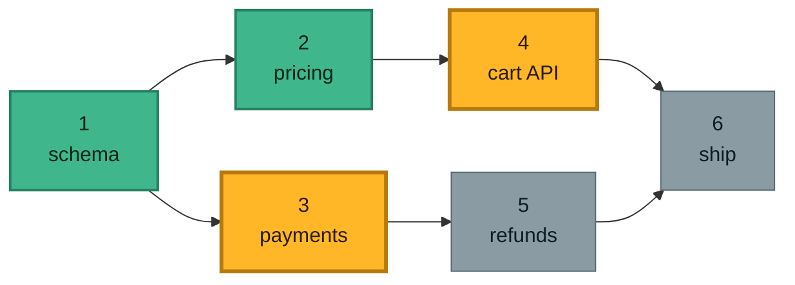
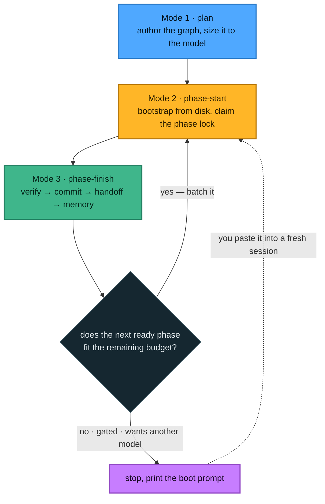
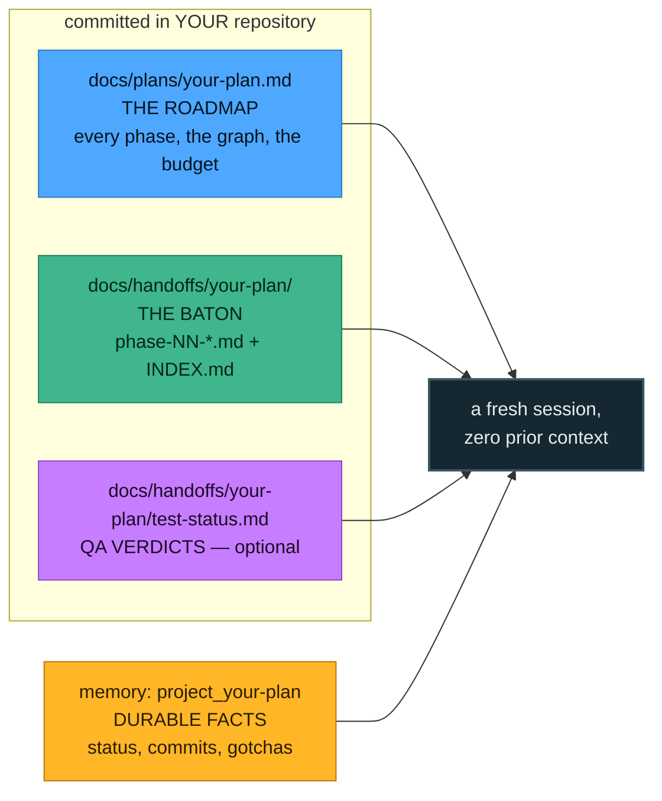
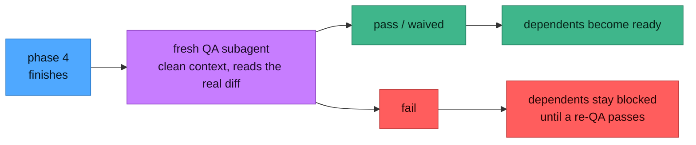

<div align="center">

# 🪜 phased-execution

**A [Claude Code](https://claude.com/claude-code) skill for running work that is too big for one
session — as a dependency graph of right-sized sessions, with a local web console to watch it.**


**English** · [فارسی](README.fa.md)

</div>

```
Phase graph — checkout-rewrite   (4/9 done)

  ✅  1  done         Schema + migrations · QA:verified
  ✅  2  done         Pricing service · QA:verified
  ✅  3  done         Payment adapter · QA:verified
  ✅  4  done         Webhook ingest · QA:verified
  🔓  5  ready        Cart API
  🔓  6  ready        Refund worker
  ⏳  7  waiting      Checkout UI
  ⏳  8  waiting      Receipts + email
  ⏳  9  waiting      Ship (GATED) 🔒GATED needs: 7, 8

READY NOW:   5 6
WAITING:     7(←5), 8(←6), 9(←7,8)
SUGGESTED BATCHES (budget ~200K, joined phases share a session): [5 6]  [7 8]  [9]
```

*That board is the product. Nothing in this system stores "what phase am I on" — it is computed,
every time, from your plan's dependency table and the handoff files on disk.*

---

## Contents

**Getting started** — [Install](#install) · [What problem this solves](#what-problem-this-solves) ·
[The idea in one picture](#the-idea-in-one-picture) · [Your first plan, step by step](#your-first-plan-step-by-step)

**Understanding it** — [The loop](#the-loop) · [The artifacts](#the-artifacts)

**Driving it** — [What you control](#what-you-control) · [Model handling](#model-handling) ·
[QA gating](#qa-gating) · [Safety rails](#safety-rails)

**Reference** — [Phase Console](#-phase-console) · [Reaching it from your phone](#-reaching-it-from-your-phone) ·
[Command reference](#command-reference) · [How skills work](#how-agent-skills-work) ·
[Requirements & tests](#requirements)

---

## Install

You need [Claude Code](https://claude.com/claude-code); the skill itself needs just Bash. The
**console** additionally needs **Node 22.6 or newer with npm** — its client is built output, one
`npm ci && npm run build` inside `viewer/` per machine. You do not have to remember that: an unbuilt
console serves a page naming the two commands and the exact directory to run them in.

Pick **one** of these two routes. They give you the same skill and the same console.

### Route A — as a plugin *(recommended: one line, updates itself)*

A **plugin** is a package Claude Code installs for you. A **marketplace** is a catalog that lists
plugins. This repository is both — it ships a catalog called `mobin` containing one plugin, itself.
So installing is one command for each.

**Step 1.** Open Claude Code in any project and type:

```
/plugin marketplace add zsarir/phased-execution
```

Claude Code clones this repository, checks the catalog inside it, and remembers it as `mobin`.
Nothing is installed yet — a marketplace is only a list.

**Step 2.** Install the plugin from that catalog:

```
/plugin install phased-execution@mobin
```

The `@mobin` part says which catalog to take it from. It matters once you have several registered.

**Step 3.** Load it:

```
/reload-plugins
```

Or just restart Claude Code. Type `/plugin` to confirm it is listed — that screen also has an
**Errors** tab if something failed.

**What you now have.** The skill, as `/phased-execution:phased-execution` — Claude Code puts every
plugin's skills under the plugin's name so two plugins can both ship a `review` skill without
clashing. Type `/phased` and let autocomplete finish it. You will rarely type it at all: the skill
describes itself well enough that Claude reaches for it on its own when work is phased. You also get
`phase-console`, a command that starts the web app from any directory — the first run serves a page
naming the client's one-time build (`npm ci && npm run build`, with the exact path printed, since a
plugin lives in a cache directory you would otherwise have to hunt for).

**Keeping it current.** `/plugin update phased-execution`. This plugin sets no version number on
purpose, which puts it on the *commit channel*: every push to `main` counts as a new release, and
Claude Code also refreshes in the background. Restart to apply an update. An update moves the plugin
to a fresh directory, so the console will ask for its build once more — same two commands, same
printed path.

**Removing it.** `/plugin uninstall phased-execution@mobin`, then optionally
`/plugin marketplace remove mobin`.

### Route B — as a plain folder *(if you want to edit the skill, or script against its path)*

```bash
git clone https://github.com/zsarir/phased-execution.git ~/.claude/skills/phased-execution
```

Restart Claude Code. The skill is `/phased-execution` — no prefix, because it is not inside a plugin.
Build the console's client once (`cd ~/.claude/skills/phased-execution/viewer && npm ci && npm run
build`), then start it with `~/.claude/skills/phased-execution/start`. Update with `git pull`, then
rebuild — `./start --agent-update` does both build and restart if it runs as a launchd agent.

### Which route?

|  | Plugin | Clone |
|---|---|---|
| **Install** | two commands, inside Claude Code | one `git clone` |
| **Updates** | automatic, every commit | when you `git pull` |
| **Skill name** | `/phased-execution:phased-execution` | `/phased-execution` |
| **Console** | `phase-console`, from anywhere | `./start`, from the folder |
| **Lives at** | a per-version cache directory that moves on every update | wherever you cloned it, permanently |
| **Suits** | wanting it present and current, with nothing to maintain | scripting against the path, or editing the skill itself |

Both at once works, but you would see the skill twice and pay its always-on cost twice. Pick one.

<details>
<summary><b>Installing from a terminal instead</b> — for dotfiles scripts and container images</summary>

```bash
claude plugin marketplace add zsarir/phased-execution
claude plugin install phased-execution@mobin
claude plugin details phased-execution@mobin      # components + token cost
claude plugin update phased-execution
claude plugin uninstall phased-execution@mobin
```
</details>

---

## What problem this solves

A big change does not fit in one Claude session. So you split it — and immediately pay for the split
twice.

**Long sessions rot.** As the context window fills, a model's recall and precision degrade. The last
third of a very long session is measurably worse work than the first third. You do not get a warning;
you just get sloppier code.

**Short sessions are expensive in a different currency.** Every fresh session has to find its footing
again: read the plan, read what the last session did, re-explore the code. That bootstrap is a fixed
tax, and chopping work into many tiny sessions pays it over and over. It also throws away the prompt
cache, which is what makes a warm session cheap.

```
    one long session   ███████████████████████████████████
                       └────────── quality decays in the tail ──────────┘

  many tiny sessions   ███▏███▏███▏███▏███▏███▏███▏███▏███
                       ▏ = a full bootstrap + closeout, paid every single time

         right-sized   ██████████▏██████████▏██████████
                       enough work to amortise ▏, few enough ▏ to stay sharp
```

**And you lose the thread.** Once work spans a dozen sessions, "which piece is next?" stops being
obvious. Piece 7 might be ready while pieces 2 and 3 are still open. A note that says *"currently on
phase 5"* goes stale the moment you finish something out of order — and then you build on a base that
was never finished.

### The three real levers

Contrary to the common belief that long sessions cost quadratically, Claude Code caches the
conversation prefix, so a warm session is roughly **linear** in turns. The things that actually hurt:

| Lever | What it is | What this skill does about it |
|---|---|---|
| **Context rot** | quality degrades as the window fills — usually bites long before cost does | sizes every session to ~60% of the window, so no session runs into the bad zone |
| **Cache-busting** | switching model, changing effort, `/compact`, a >5-min idle gap — each forces a full-price re-read | makes a model switch an explicit session boundary; discourages mid-phase `/compact` |
| **Bootstrap tax** | each fresh session re-reads plan + handoff + code before it can do anything | batches adjacent work into one session so the tax is paid once, not five times |

---

## The idea in one picture

Work is a **dependency graph**, not a checklist. Each phase declares which phases must finish before
it can start. Then one rule decides everything:

> **A phase is `ready` when it has not been started and *every* dependency is `done`.**

Readiness is computed from the set of finished phases — never from a counter. That single choice is
what makes out-of-order and fan-out progress safe.



Phases **1** and **2** are done. That makes **3** ready *(its only dependency, 1, is done)* and **4**
ready *(its only dependency, 2, is done)* — one finished phase unblocked two. **5** and **6** wait,
because a dependency of each is still open.

Two consequences worth internalising:

- **Finishing a phase can unblock several.** They still run **one at a time** — never two Claude
  sessions against the same working tree — but you can pick whichever you like.
- **"Finished" means every phase is done**, not "we reached the highest number". You can complete
  1 → 4 → 6 and the board will still, correctly, show 3 and 5 as unfinished.

---

## Your first plan, step by step

Nothing here is ceremony you perform by hand. You talk to Claude; the skill drives the procedure.
This is what actually happens, so you can recognise it.

### Step 1 — Ask for it

In your project, tell Claude what you want built, and that it should be phased:

```
/phased-execution

I want to rewrite checkout: new schema, a pricing service, a payment adapter,
webhook ingest, cart API, refunds, the UI, receipts, and a ship step.
```

You can also just describe big work — the skill announces itself when it fits.

### Step 2 — Answer one question about the model

Claude asks which model will *execute* the phases, because that decides how big each session may be.
If you do not care, say so and it uses a sensible default. See
[Model handling](#model-handling) for what changes.

### Step 3 — Claude writes the plan

It creates `docs/plans/checkout-rewrite.md` in **your** repository, containing:

- why the work exists and the key design decisions
- a **`## Session budget`** note: target model, per-session budget, branch, and any options you asked for
- a **`## Phase graph`** table — this is the machine-read part, one row per phase with its dependencies
- one self-contained section per phase: goal, size, files, steps, **exit criteria**, **verification commands**
- an end-to-end verification section for when it is all done

Then it checks its own work:

```bash
scripts/phase-graph.sh checkout-rewrite        # does the board look right?
scripts/validate.sh checkout-rewrite           # malformed rows? undefined deps? cycles?
```

Read the plan. **This is your main point of control** — it is a normal markdown file, and editing it
changes what happens next. Everything in [What you control](#what-you-control) is a line in this file.

### Step 4 — Claude commits the plan and starts building

The same session then implements Phase 1 — no cold restart between planning and starting, because the
context is already warm.

### Step 5 — At the end of each phase

Claude runs a fixed checklist, in this order, and the order matters:

1. **Verify** — run that phase's own verification commands. All green, or the phase is handed off as
   `blocked`. A red phase is never handed off as complete.
2. **Commit** — explicit file paths, never `git add -A`.
3. **Write the handoff** — `docs/handoffs/checkout-rewrite/phase-01-schema.md`: what changed, which
   files, which decisions, what the next session needs. This is what makes a cold start possible.
4. **Update memory** — the durable facts that must outlive the docs.
5. **Decide: continue, or stop.**

### Step 6 — Continue or stop

If the next ready phase fits the **remaining** session budget, Claude just continues into it — same
session, warm cache, no bootstrap. That is the efficient default.

If the budget is spent (or the next phase is gated, or wants a different model), it stops and prints a
**boot prompt**: a copy-pasteable block that boots the next phase in a brand-new session with zero
prior context. You open a fresh session, paste it, and work resumes exactly where it left off.

```
────────────────── START COPY ──────────────────
Continue plan `checkout-rewrite` — Phase 5 (Cart API).
Read docs/plans/checkout-rewrite.md §Phase 5 and
docs/handoffs/checkout-rewrite/phase-02-pricing.md first.
...
─────────────────── END COPY ───────────────────
```

### Step 7 — Check on it any time

```bash
scripts/phase-graph.sh checkout-rewrite      # the board
phase-console                                # or the whole thing in a browser
```

---

## The loop

Three modes. You never name them; Claude picks the one that matches the situation and says which it
is using.



The important property: **Mode 2 bootstraps from disk only.** A fresh session reads the plan, the
dependency handoffs and the memory entry — and that has to be enough. If it is not, the previous
handoff was deficient, and *that* is the bug to fix.

---

## The artifacts

Four files, one job each. They never duplicate each other, and the same `<slug>` ties them together
so one search finds all of them.



| Artifact | Where | Its one job |
|---|---|---|
| **Plan** | `docs/plans/<slug>.md` | The durable roadmap: every phase, the dependency graph, per-phase detail, exit criteria. Written once, rarely edited. |
| **Handoff** | `docs/handoffs/<slug>/phase-NN-*.md` + `INDEX.md` | The baton for the *next* cold session: state now, files changed, decisions, exact next commands. Written at the end of every phase. |
| **Memory** | `project_<slug>` in your memory index | Durable cross-session facts — status as a *set*, commit shas, gates, gotchas. |
| **QA status** *(opt-in)* | `docs/handoffs/<slug>/test-status.md` + `reports/` | Per-phase verdicts that **gate dependents**. Does not exist unless you turn QA on. |

Plans and handoffs live in **your project repo**, committed and pushed — so any machine or account can
pull and continue. The skill itself stays separate; work-state never goes in the skill folder.

---

## What you control

This is the part most people miss. The plan is a plain markdown file, and a handful of lines in it are
**read by the engine**. Change a line, change the behaviour. You can ask Claude for any of these in
plain language at plan time, or edit the file yourself afterwards.

### The control surface at a glance

| You want to… | Put this in the plan | Where |
|---|---|---|
| Choose the executing model | `**Target model:** claude-opus-4-8` | `## Session budget` |
| Change how much work fits a session | `**Budget:** ~200K weight/session` | `## Session budget` |
| Use a different model for one phase | `- **Model:** haiku` | that `### Phase N` block |
| Say how big a phase is | `- **Size:** S` \| `M` \| `L` | that `### Phase N` block |
| Turn QA on | `**QA gate:** on` | `## Session budget` |
| Turn QA off explicitly | `**QA gate:** off` | `## Session budget` |
| Commit to a specific branch | `**Branch:** feature/checkout` | `## Session budget` |
| Force skills into every session | ``**Skills (every session):** `design-system` `` | `## Session budget` |
| Say a phase depends on others | the `Depends on` column | `## Phase graph` table |
| Block a phase behind something external | `*(GATED)*` + `- **Gates (must clear first):** …` | that `### Phase N` heading |
| Make that gate machine-checkable | `- **Gate-check:** date 2026-09-01` | that `### Phase N` block |

A complete `## Session budget` note looks like this:

```markdown
## Session budget

> **Target model:** `claude-opus-4-8` (1M window) · **Budget:** ~200K weight/session (≈60% of the
> window) · **Branch:** current branch (no new branch).
> **Skills (every session):** `design-system`, `some-plugin:test-first`
> **QA gate:** on
```

### 1 · Which model runs the phases

Phases are usually *executed* later, in fresh sessions, possibly by a different model than the one
planning now. So the plan records a target, and every phase-start re-checks it against the model
actually running — if they differ, the budget is recomputed and the batching changes. A common split
is one model planning and another executing.

### 2 · How much work fits one session

The **budget** is measured in summed phase *weight*, not raw context, and defaults to **~0.2 × the
model's effective window**. That lands a full session near ~60% real window use — clear of
auto-compaction (~83%) and clear of the late-window quality zone. Override it if your session's
effective window is smaller than the model's maximum:

```bash
scripts/phase-graph.sh checkout-rewrite --session-plan 40000   # a raw budget in tokens
```

### 3 · How big each phase is

Tag a phase and the engine can group phases into sessions for you:

| Tag | Working set | Looks like |
|---|---|---|
| `S` | ≤ ~15K tokens | a focused edit, a migration, one small file, a doc |
| `M` *(default)* | ~15–50K | a typical feature across a few files with some exploration |
| `L` | ~50–120K | a substantial subsystem, heavy exploration, large diffs |

Untagged phases are treated as `M`. A phase whose weight exceeds one session's budget is really two
phases — split it.

### 4 · Whether phases share a session

```bash
scripts/phase-graph.sh checkout-rewrite --session-plan opus
```

It walks the *remaining* phases in dependency order and groups them while every dependency is already
satisfied and the summed weight fits the budget. It always cuts at gated phases, at unmet
dependencies, and at QA boundaries. Treat it as a suggestion — Claude confirms it against the live
context meter.

### 5 · Whether QA runs

Off by default. See [QA gating](#qa-gating) — it is a real gate, not a report, so turning it on
changes which phases are allowed to start.

### 6 · Which branch the work lands on

**Default: no new branch.** Work commits to whatever branch is already checked out, because scattering
a plan across branches you never asked for is worse than the alternative. If you *do* ask for a
branch, exactly **one** branch carries the whole plan — every phase, including independent ones in
separate sessions — and the plan records its name so every cold session checks out the same one.

### 7 · Which skills every session must use

If your work needs a particular skill applied consistently — a design skill, a TDD skill — naming it
once on the `Skills (every session):` line means the engine re-injects it into **every** phase's boot
prompt and into the QA brief. Cold sessions cannot forget it.

### 8 · What blocks a phase from starting

Beyond dependencies, a phase can be **gated** on something outside the code — a deploy window, an
approval, someone else's migration. Gated phases are never batched past. Three machine-checkable
kinds:

```markdown
- **Gate-check:** date 2026-09-01     # opens on that date
- **Gate-check:** phase 7            # clears when phase 7 is verified
- **Gate-check:** manual sign-off from ops
```

```bash
scripts/phase-graph.sh checkout-rewrite --gate-status 9    # exit 0 = clear, 1 = blocked
```

### 9 · Where the docs live

Scripts find your repo root automatically, including from inside a submodule. Override it when you
need to:

```bash
DOCS_ROOT=/path/to/repo scripts/phase-graph.sh checkout-rewrite
```

---

## Model handling

Everything about sizing flows from the model you are running.

| Model | Window | Session budget *(phase weight)* | Best used for |
|---|---|---|---|
| **Opus** 4.8 / 4.7 / 4.6 | 1M | **~200K** | the default executor; hard reasoning and architecture |
| **Fable 5** | 1M | **~200K** | planning, and the most demanding long-horizon phases |
| **Sonnet** 5 / 4.6 | 1M | **~200K** | balanced implementation phases |
| **Haiku 4.5** | 200K | **~40K** | mechanical, cheap phases — so: smaller phases, more of them |
| *unknown / unspecified* | — | **~40K** | assumes a 200K effective window |

These numbers live in one place, [`scripts/sizing.env`](scripts/sizing.env), which the engine reads
directly — so the docs and the tool cannot drift apart. Edit that file to change them globally.

**Why weight, and why 0.2×.** A phase's weight estimates the working set its work adds — bootstrap
reads, files opened, tool output, diffs. Real session context runs about **3× the summed weight**
once the system prompt, thinking, tool chatter and conversation overhead sit on top. So a ~200K budget
lands near ~600K of real context on a 1M model: about 60% utilisation. Filling the window to 100% is a
trap for exactly this reason — the weights under-count reality threefold.

> ⚠️ **Check your *effective* window, not the model's maximum.** A session can be configured with a
> 200K window even on a 1M-capable model. Budget ≈ 0.2 × the window you actually have.

**Per-phase model choice is a lever too.** Hard reasoning on Opus or Fable, balanced implementation on
Sonnet, rename sweeps and boilerplate on Haiku. One caveat: switching models mid-session throws away
the prompt cache, so keep one model per session — a wanted model switch is one of the few things that
*earns* a session boundary.

**Keeping a session lean** stretches the budget: push broad code search and multi-file exploration
into subagents that read a lot and return a short summary, so those tokens never enter the phase
session. Do not over-delegate — a single file read is faster done directly.

---

## QA gating

QA here is not a report you read afterwards. It is a **gate**: with it on, a phase's dependents are
not allowed to start until that phase is verified. That is the whole point — a broken phase should not
silently propagate into everything built on top of it.



**Turning it on.** Ask for it at plan time and the plan records `**QA gate:** on`. Ask for it later
and the next phase-finish picks it up. Check which regime a plan is in:

```bash
scripts/phase-graph.sh checkout-rewrite --qa-mode      # off | on <reason> | waived <reason>
```

**Why a *fresh* subagent.** The session that built the phase shares the blind spots of the code it
just wrote. QA runs in a subagent with a clean context that reads the real diff cold — it verifies
commits against `git show` rather than trusting the handoff's summary, checks every exit criterion,
sweeps for correctness, edge cases, error handling, regressions and security, and runs the tests. A
suite that is green but does not actually cover the criteria is a **fail**, not a pass.

**The verdicts.**

| Verdict | Meaning | Effect on dependents |
|---|---|---|
| `pass` | every exit criterion met with evidence, tests green, no high/critical findings | released |
| `fail` | a criterion unmet, a high/critical finding, or red tests | **held** until a re-QA passes |
| `waived` | genuinely not applicable, justified explicitly | released |
| `pending` | recorded but not yet judged | held |

On a fail, the QA subagent does **not** fix the code — it returns the verdict and enumerates the
follow-ups. The finishing session owns the fix, and re-QA is always a *new* fresh subagent, never a
re-run inside the one that failed. Results are committed and pushed so the gate reaches every clone.

Verdicts are recorded only through `scripts/qa-record.sh` — an idempotent upsert. Never hand-edit
`test-status.md`.

---

## Safety rails

Things that stop the system hurting you, all of them mechanical.

**Phase locks.** Starting a phase claims it — a small lock file in your repo recording who holds it
and a lease that auto-expires. If a second session finds the phase held by a live session, it stops
and asks rather than building the same phase twice. Locks are committed, so they work across machines
and accounts.

**One session per working tree.** Phases run serially even when several are ready. Two Claude sessions
in one directory overwrite each other mid-edit and produce test failures nobody can explain. Need real
parallelism? Give each session its own checkout or `git worktree` — never share a directory.

**Never stash to hand off.** A `git stash` lives in one working tree and is invisible to every other
session and clone. Commit instead — even a WIP commit. The filesystem of a closed session is not a
channel; git is.

**Verification before handoff.** A phase's own verification commands must be green before it can be
handed off as complete. Red work is handed off as `blocked`, with the failure recorded, so the board
shows the truth.

**Structural validation.** `scripts/validate.sh <slug>` catches malformed graph rows, dependencies on
phases that do not exist, cycles, invalid handoff statuses, missing required sections, and handoffs
whose declared dependencies disagree with the plan. Run it before trusting a board.

**Explicit-path commits.** Never `git add -A` — a phase commits the files it touched, so unrelated
work in your tree is not swept in.

---

## 🚉 Phase Console

> *The whole plan library in one page.*

```bash
phase-console                      # installed as a plugin — from anywhere
./start                            # cloned — from the folder
./start ~/code/your-repo           # skip the picker
./start --allow-writes             # plus the guarded write verbs
./start --allow-run                # plus the autopilot
```

*(First time on a machine: the client is built output — `cd viewer && npm ci && npm run build`, or
let the console's own page tell you. As a launchd agent, `deploy/agent.sh install|update` builds it
for you.)*

A plan library outgrows a terminal: dozens of plans, hundreds of phases, hundreds of handoff files —
and the engine answers for exactly one plan at a time. The console is the portfolio view: what is
ready **right now** across every plan, which lock is holding what, which plan has stalled, how much
work is left, and whether a plan's graph even lints.

| Screen | Contents |
|---|---|
| **Source** | Pick any repository with `docs/plans`. Recent choices are remembered; switch at any time from the left rail. |
| **Plans** | Every plan with progress, ready phases, locks, QA regime and health. Newest activity first; filter by status, ready, locked or repo. |
| **Route** | The plan as a transit map — phases are stations, dependencies are track, and each suggested session batch is a train threading the stations it carries. |
| **Departures** | The board: state, size, dependencies, gates, locks and QA for every phase. |
| **Phase** | Goal, read-first, files, steps, exit criteria, verification — plus that phase's handoff, gate status, lock and its **boot prompt**, ready to copy. |
| **Handoffs** | Every handoff with its front-matter contract, body and the boot prompts it generated. |
| **Analysis** | Critical path, bottleneck, best next phase, remaining weight and sessions, completion timeline, QA table, health issues. |
| **Overview** | Context, architecture, session budget, the phase-graph table, end-to-end verification and the plan's memory entry. |
| **Ready now** | Every ready phase across every plan, ranked by how much it unblocks. |
| **Statistics** | Portfolio totals, velocity, completions calendar, size mix, repos, skills, target models, locks and every health issue. |
| **Autopilot** | Drive a plan unattended: one `claude -p` per phase, the live session console, the approval queue, and the controls to pause, stop, retry, skip or run a single phase. |
| **Terminal** | A real shell in the browser — off unless started with `--allow-terminal`; token-handshaked WebSocket, sessions that survive a reload, a phone key bar. |
| **Search** | Full text across all plans and handoffs, grouped by plan. |

It **updates itself**: a watch on `docs/` pushes changes over server-sent events, so a handoff written
by an agent session appears without a reload.

**One rule governs the design.** `phase-graph.sh` is the only source of truth for done / ready /
waiting, session batches, boot prompts, QA regime and lint — the console shells out to those same
scripts for every status claim and never recomputes it. JavaScript parsing covers only what the
scripts do not expose (prose, phase detail, handoff bodies) plus analysis they do not provide
(critical path, unblock value, velocity). A parity test re-derives every plan's board from that parse
and asserts it matches the engine, so the two readings cannot drift apart unnoticed.

**Writes are off by default.** With `--allow-writes` the console can scaffold a plan or handoff,
record a QA result and manage phase locks — each behind a dialog showing the exact command first.
`--git` is never passed, so it can never commit or push. The server binds to `127.0.0.1`, and keeps
binding there even when you reach it from elsewhere — `--remote` puts an authenticating proxy in
front of the loopback socket rather than opening one on a network.

**Runs are off by default too, behind their own flag.** `--allow-run` enables the **autopilot**: the
console drives a plan unattended, one `claude -p` process per phase, so "clear the session between
phases" needs no implementing — the process exits and takes its context with it. A phase advances only
when three independent checks agree: the plan's own verification passes, `validate.sh` still passes,
and the board re-read *from disk* says done. Nothing asks the session whether it succeeded. Model,
effort and skills are chosen per run or per phase; a command that reaches outside the working tree
raises an **approval** and waits for a person. It is a separate flag from `--allow-writes` on purpose:
a write scaffolds a file, a run edits a repository for hours.

**It runs on a phone.** Watching a run and answering an approval are the two things that cannot wait
until you are back at the desk, so the console can be driven from one — over your own private
network, with nothing exposed to the internet. Setup:
[Reaching it from your phone](#-reaching-it-from-your-phone).

Details: [viewer/README.md](viewer/README.md).

---

## 📱 Reaching it from your phone

> *An unattended run exists so you can stop watching it. That only pays off if it can still reach you.*

A run halts when it needs a person — a command it will not take on its own authority, a check only
you can make. It raises an **approval** and waits. If the console is only reachable from the chair in
front of it, every one of those pauses lasts until you sit back down.

This section sets up the console so you can watch a run, answer an approval, and start the next phase
from a phone, on any network, without putting anything on the public internet.

It takes about ten minutes, and most of it is clicking two switches.

### The shape of it

```
  your phone, anywhere                       your machine
  ────────────────────                       ────────────
  https://your-machine.your-tailnet.ts.net
        │
        │  encrypted, private network, no open ports
        ▼
  tailscaled ──────────── sets Tailscale-User-Login: you@example.com
        │
        │  http://127.0.0.1:4123
        ▼
  Phase Console ───────── still bound to loopback. It always was.
```

**The console does not open a port on a network — not before this, and not after.** It keeps
listening on `127.0.0.1`, and something that already knows who you are is placed in front of that
socket. [Tailscale Serve][ts-serve] is that something: it terminates TLS, authenticates the caller
against your private network, and forwards to loopback with the caller's login in a header.

That header is the whole authentication story, and it is only worth anything *because* the console
stays on loopback. If it listened on a network interface, anyone who could reach it could simply send
the header themselves. This is [Tailscale's own guidance][ts-serve]: *"it's best practice to only
have the service listen on localhost."*

You need a [Tailscale](https://tailscale.com) account. The free tier covers this comfortably.

### Step 1 · Turn on three things for your tailnet

All three are off by default and all three are needed. The first two are on the [DNS page of the
admin console](https://login.tailscale.com/admin/dns):

1. **Enable MagicDNS.** This is what makes `your-machine.your-tailnet.ts.net` resolve for your own
   devices. Without it you would be typing an IP address, and an IP address cannot have a
   certificate.
2. **Enable HTTPS Certificates.** Tailscale then provisions a real, publicly-trusted certificate for
   that name. HTTPS *requires* MagicDNS, so do them in this order.
3. **Enable Serve.** This one has no switch to find in advance: the first time you run
   `tailscale serve` on a tailnet that has never used it, the command prints an approval link
   containing that machine's node ID and then **waits** rather than exiting. Open the link, approve
   it, and the command you already ran continues on its own. If you would rather do it up front, run
   the Step 4 command now and click what it gives you.

> **Know what you are agreeing to.** Every certificate on the web is recorded in the public
> Certificate Transparency log, so enabling this publishes your machine's name — e.g.
> `your-machine.your-tailnet.ts.net`. The **name** becomes public. The machine does not: it stays
> unreachable from the internet, and nothing about this opens a port.

While you are in the admin console, on the [Machines
page](https://login.tailscale.com/admin/machines), **disable key expiry** for this machine. Node keys
expire by default, and when one does, remote access stops with no warning and no obvious cause.

### Step 2 · Put your phone on the same tailnet

Install the Tailscale app, sign in with the same account, and — this one is easy to miss — make sure
**"Use Tailscale DNS" is ON** in the app's settings. It is what lets the phone resolve the `.ts.net`
name. Without it the name simply will not load, and nothing else in this guide will work.

Check `tailscale status` on your machine; the phone should be listed.

### Step 3 · Tell the console who may arrive

Two new flags. Neither changes what the server binds to:

| Flag | Meaning |
|---|---|
| `--remote <host>` | The console also answers to this hostname, which is fronted by an authenticating proxy. Repeatable. |
| `--remote-user <login>` | A login allowed to arrive that way. Repeatable, or `PHASE_CONSOLE_REMOTE_USERS` as a comma-separated list. **Required** by `--remote`. |

```bash
./start --root ~/code/your-repo --allow-writes --allow-run \
        --remote your-machine.your-tailnet.ts.net \
        --remote-user you@example.com
```

Use your real MagicDNS name — `tailscale status --json` prints it as `Self.DNSName` — and the login
you signed in with.

`--remote` without `--remote-user` **refuses to start**. Starting with no allowlist would look
completely correct and quietly admit everyone on your network, so it is an error rather than a
warning.

To have it survive reboots and logouts, install it as a launchd agent with the same flags — they are
passed straight through:

```bash
./start --install-agent --root ~/code/your-repo --allow-writes --allow-run \
        --remote your-machine.your-tailnet.ts.net --remote-user you@example.com
./start --agent-status
```

### Step 4 · Put the proxy in front of it

```bash
tailscale serve --bg --https=443 http://127.0.0.1:4123
tailscale serve status          # confirm what is being served
```

**The first run on a tailnet that has never used Serve will not return.** It prints
*"Serve is not enabled on your tailnet"* with an approval link, and waits for you to open it. That is
the Step 1 item you cannot do in advance — approve it and the command finishes by itself. Every run
after that returns immediately.

**`--bg` is not optional if you want this to last.** With it, Serve is persistent: it comes back
after a reboot and after `tailscale down` / `tailscale up`. Without it, Serve lives only as long as
that foreground command, and you will be re-running it by hand forever.

To undo it: `tailscale serve --https=443 http://127.0.0.1:4123 off`, or `tailscale serve reset` to
clear everything.

Now open `https://your-machine.your-tailnet.ts.net/` on the phone. Padlock, no warning, no port
number.

### Step 5 · Install it on the Home Screen

In Safari: **Share → Add to Home Screen**.

This is not decoration. On iOS, **web notifications only exist for a site installed to the Home
Screen** — in an ordinary Safari tab the permission cannot even be requested. Since the notification
is the entire point of being reachable, the install is part of the setup rather than a nicety.

Once it is installed, open it from the Home Screen and grant notification permission from the button
in **Settings**. Permission is never demanded on load: a page that asks the moment it opens gets
refused by reflex, and that refusal is permanent.

You will get a notification when a run **halts**, when it is **parked**, when it **finishes**, and
when an **approval** is waiting — and deliberately not for every phase, because a channel that fires
constantly is a channel you learn to ignore.

Android needs none of this — notifications work in a normal HTTPS tab — but installing it still gives
you a cleaner window.

### Step 6 · Turn on push, and choose what it sends

**Settings → Notifications** has two switches, and the difference between them is the whole point:

| | What it is | When it fires |
|---|---|---|
| **In this tab** | The Notification API, raised by the page. | Only while a tab is open somewhere. |
| **On this device** | A push subscription, delivered by Apple, Google or Mozilla to a service worker. | With the console closed, the phone locked, the laptop asleep. |

Press **Turn on** under *On this device*, then **Send a test** — it goes out through the real push
service and back, so a notification appearing proves the whole chain rather than the last hop of it.

Do it on the laptop too. `http://127.0.0.1` counts as a secure context, so the same button works
there with no HTTPS involved, and every browser gets its own subscription and its own choices.

**Eight categories, per device**, because a phone and a laptop rarely want the same ones:

| Category | Default | Fires when |
|---|---|---|
| **Permission needed** | on | A session is blocked on a decision only you can make. Nothing proceeds until you answer. |
| **Run halted** | on | A run stopped on something that must not be automated past — or was interrupted with nothing driving it. |
| **Run parked or waiting** | on | Every remaining phase needs a person, or the run is asleep until a usage window reopens. |
| **Phase finished or failed** | on | Each phase as it lands. The pulse of a run nobody is watching. |
| **Plan finished** | on | A run reached the end of its plan. |
| **Work became ready** | off | A phase became startable — including because of work you finished yourself, elsewhere. |
| **Plans changed on disk** | off | Any plan or handoff was written. A firehose: an agent editing a handoff mid-phase fires it. |
| **Console problems** | on | The console degraded or its file watch went deaf — the failure that otherwise looks exactly like everything working. |

Only *Permission needed* and *Run halted* are sent urgent, because they are the two that mean nothing
moves until you act. The rest arrive quietly. A channel that always buzzes is a channel you turn off,
and the notification it gets turned off for is the one that mattered.

Payloads are encrypted to a key only your browser holds ([RFC 8291][rfc8291]), so the push service
relays a notification about your plans without being able to read one. Nothing is installed to make
that work — the implementation is `node:crypto` and about four hundred lines.

### Step 7 · Alerts with no browser involved at all *(optional)*

Push still needs a browser somewhere, even a closed one. For a machine where that is not true — a
headless box, a pager, a chat channel — point `PHASE_CONSOLE_NOTIFY` at a script. It is run as
`your-script "<title>" "<body>"` whenever a run needs a person:

```bash
#!/bin/sh
# ~/.local/bin/phase-notify
curl -s -H "Title: $1" -d "$2" https://ntfy.sh/your-private-topic-name >/dev/null
```

```bash
chmod +x ~/.local/bin/phase-notify
export PHASE_CONSOLE_NOTIFY=~/.local/bin/phase-notify   # or add it to the launchd agent's environment
```

[ntfy](https://ntfy.sh) is the shortest path — install its app, subscribe to the topic. Pushover,
Slack or a webhook of your own work the same way.

> **This sends plan names and approval details to whatever service you choose.** Pick a topic name
> nobody will guess, and if the work is sensitive, [self-host ntfy](https://docs.ntfy.sh/install/) or
> point the script somewhere you control. The variable is environment-only on purpose — nothing
> reachable from a web page gets to choose which command runs.

### What is actually enforced

Once you name a hostname, strict `Host` checking turns on and exactly two kinds of request are
served:

| Request | Verdict |
|---|---|
| Loopback `Host`, no identity header | **Served.** You, at this machine — unchanged from before. |
| Your `--remote` hostname + an allowlisted login | **Served.** You, through the proxy. |
| Your `--remote` hostname, no identity header | **403.** Something reached the console without going through the proxy. |
| Your `--remote` hostname, a login not on the list | **403.** Someone else on your network. |
| Any other `Host` | **421.** This is what a DNS-rebinding page arrives with. |
| Loopback `Host` **carrying** an identity header | **421.** See below. |

That last row is doing real work and is worth understanding. Anyone on your private network can put
whatever they like in a `Host` header — including `127.0.0.1`. If a loopback `Host` alone meant
"local", such a request would skip the identity check entirely. It cannot: the proxy sets the
identity header on everything it forwards, so a loopback `Host` arriving *with* one is a combination
no honest client produces.

The other half of the assumption is that a caller cannot simply claim to be you. Serve **overwrites**
`Tailscale-User-Login` with the authenticated identity rather than passing through whatever the
client sent — worth knowing rather than assuming, and easy to confirm on your own setup:

```bash
# sent with a forged identity, through the proxy — served, because the proxy replaced it
curl -s -o /dev/null -w '%{http_code}\n' \
  -H 'Tailscale-User-Login: mallory@example.com' https://your-machine.your-tailnet.ts.net/api/state
```

A `200` means the header you sent never reached the console. A `403` would mean it did, and that the
only thing standing between you and impersonation is the attacker not knowing which login to claim.

You can check the rest of it from the machine, without a phone:

```bash
C=http://127.0.0.1:4123
H=your-machine.your-tailnet.ts.net
curl -s -o /dev/null -w '%{http_code}\n' $C/api/state                                        # 200
curl -s -o /dev/null -w '%{http_code}\n' -H "Host: evil.example"  $C/api/state               # 421
curl -s -o /dev/null -w '%{http_code}\n' -H "Host: $H"            $C/api/state               # 403
curl -s -o /dev/null -w '%{http_code}\n' -H "Host: $H" -H "Tailscale-User-Login: you@example.com" $C/api/state   # 200
```

Use `curl`, not a `fetch()` in a browser console — `Host` is a forbidden header name there, so it is
dropped silently and every case will look like a pass.

### Locking it down further *(optional)*

Serve obeys your access rules like anything else on the tailnet. If more than one person or machine
is on yours, scope it. In the [access controls](https://login.tailscale.com/admin/acls):

```jsonc
{
  "grants": [
    { "src": ["autogroup:owner"], "dst": ["autogroup:self"], "ip": ["tcp:443"] }
  ]
}
```

It is also worth removing machines you no longer use. They are the only devices that could reach the
console at all.

### What not to do

- **Do not use `--host 0.0.0.0` instead of this.** It puts the console — which with `--allow-run`
  starts agent sessions that edit your repository — on every network you join, with no
  authentication whatsoever. It also breaks the approval hook: the address the child sessions call
  back on is derived from the bind address, and that hook **fails open**, so the ask-list would stop
  working *silently* and every session would run on the deny rules alone.
- **Do not use `tailscale funnel`.** Funnel is Serve's public sibling: it publishes to the entire
  internet. Everything above depends on the caller being someone your network already vouched for.
- **Do not skip HTTPS.** Plain HTTP to a hostname is not a [secure context], so notifications are
  unavailable and the Home Screen install is degraded. The tunnel is encrypted either way — this is
  about what the browser will let the page do.

### When it does not work

| Symptom | Cause |
|---|---|
| The name does not resolve on the phone | MagicDNS off in the admin console, or **"Use Tailscale DNS"** off in the phone's Tailscale app. |
| `tailscale serve` prints *"Serve is not enabled on your tailnet"* and never returns | Serve is a tailnet capability that is off until someone approves it. Open the link the command printed — it is specific to that machine — and approve it. The command is waiting for exactly that and will continue on its own; do not kill it. |
| `tailscale serve` errors about certificates | HTTPS Certificates not enabled. Step 1. |
| **403** — *"No caller identity"* | You reached the console directly rather than through Serve, or Serve is not running. Check `tailscale serve status`. |
| **403** — *"… is not allowed to use this console"* | The login is real but not in `--remote-user`. |
| **421** — *"does not answer to …"* | The hostname you opened is not the one you passed to `--remote`. They must match exactly. |
| **421** — *"arrived through a proxy but asks for a local hostname"* | Something rewrote the `Host` header to `localhost`. Serve does not; a proxy in between might. |
| The console will not start | `--remote` with no `--remote-user`. The error says so. |
| The notification button does nothing on iOS | Not installed to the Home Screen, or you are on plain HTTP. Both are required. |
| **Turn on** is missing and a banner explains why | Permission was refused for this site once. A page cannot ask twice — it has to be changed in browser settings. |
| **Send a test** says it was handed over, and nothing appears | Three separate yeses are involved — the push service, the browser, and the operating system — and only the first answers back. This is almost always the third: macOS *System Settings → Notifications → your browser*, or Windows *Settings → System → Notifications*. A Focus mode does it silently too. |
| **Send a test** says *gone* | The subscription was revoked at the browser end. Turn it off and on again; the register drops dead subscriptions by itself. |
| Push worked, then stopped after reinstalling the app | A reinstall makes a new subscription. The old row is dropped on its next failure; subscribe again from the new install. |
| Worked yesterday, dead after a reboot | `tailscale serve` was run without `--bg`. |
| Worked for weeks, then stopped | The machine's node key expired. Disable key expiry (Step 1). |
| Works on wifi, not on cellular | Tailscale toggled off on the phone, or iOS disabled its VPN profile. |

[ts-serve]: https://tailscale.com/docs/features/tailscale-serve
[secure context]: https://developer.mozilla.org/en-US/docs/Web/Security/Secure_Contexts
[rfc8291]: https://datatracker.ietf.org/doc/html/rfc8291

---

## Command reference

Run these from the repository that owns `docs/`, or set `DOCS_ROOT`.

### The engine

```bash
scripts/phase-graph.sh <slug>                    # the board (default)
scripts/phase-graph.sh <slug> --lint             # structural validation; non-zero on a problem
scripts/phase-graph.sh <slug> --ready            # ready phase numbers
scripts/phase-graph.sh <slug> --ready-after N    # the ready set assuming N just completed
scripts/phase-graph.sh <slug> --deps N           # N's prerequisites
scripts/phase-graph.sh <slug> --dependents N     # phases N blocks
scripts/phase-graph.sh <slug> --size N           # S | M | L
scripts/phase-graph.sh <slug> --gated N          # yes | no
scripts/phase-graph.sh <slug> --gate-status N    # evaluate the machine gate
scripts/phase-graph.sh <slug> --boot-prompt N    # the copy-paste prompt for phase N
scripts/phase-graph.sh <slug> --session-plan opus   # proposed session grouping
scripts/phase-graph.sh <slug> --qa-mode          # off | on <reason> | waived <reason>
scripts/phase-graph.sh <slug> --qa-result N      # the recorded verdict
scripts/phase-graph.sh <slug> --qa-prompt N      # the QA subagent's brief
scripts/phase-graph.sh <slug> --memory-block     # done/ready/waiting, for the memory entry
```

### The helpers

| Script | What it does |
|---|---|
| `new-plan.sh <slug>` | Scaffold `docs/plans/<slug>.md` from the template. |
| `new-handoff.sh <slug> <N> <title> [status] [--qa] [--force]` | Scaffold the phase handoff, update `INDEX.md`, auto-fill dependencies and generate a boot prompt per unblocked phase. |
| `handoff-status.sh <slug>` | The INDEX, per-file status, and the live board. |
| `next-phase-prompt.sh <slug> <N\|none>` | End-of-phase banner, board, batching advice, and a boot prompt for every newly ready phase. |
| `phase-lock.sh <slug> claim\|release <N> --owner <id> [--force] [--git]` | Claim or release a phase lock. |
| `qa-record.sh <slug> <N> <pass\|fail\|waived\|pending> --report <path>` | Record a QA verdict. |
| `validate.sh <slug>` | Full validation — plan structure *and* handoff consistency. |

---

## How Agent Skills work

A [Skill](https://code.claude.com/docs/en/skills) is a folder with a `SKILL.md` whose frontmatter
(`name` + `description`) is the *only* part always loaded. Claude reads the full body **only when the
skill is relevant or invoked**, and bundled scripts run via Bash without their code ever entering the
context window. That is why a skill costs almost nothing until it is used — this one is **~190 tokens**
in every session, and ~9K only on the turns where it actually fires.

```
phased-execution/
├── SKILL.md          # frontmatter + the procedure Claude follows
├── USAGE.md          # human-facing orientation
├── start             # launch the console
├── bin/              # phase-console — the same launcher, on PATH for plugin installs
├── scripts/          # the engine and its helpers (run, don't read)
├── references/       # plan/handoff formats, conventions, sizing, QA method
├── templates/        # plan, handoff and INDEX scaffolds
├── tests/            # bats suite for the scripts
├── viewer/           # Phase Console — the local web app
└── .claude-plugin/   # marketplace.json — makes this repo installable as a plugin
```

There is deliberately no `plugin.json`. The marketplace entry carries the plugin's metadata itself
(`strict: false`), which keeps this folder a plain skill when you clone it — one tree, both install
paths, neither getting in the other's way.

**▶ How the loop actually runs, in detail:** [USAGE.md](USAGE.md).

## Requirements

**Bash** for the scripts — that is the whole skill. The console additionally needs **Node 22.6 or
newer with npm**: its server runs TypeScript directly, and its client is built once per machine
(`npm ci && npm run build` in `viewer/`; the console names those commands itself until they have
run). Once built it bundles everything — fonts included — so it works offline and installs to a
phone's home screen. No service, no configuration file.

## Tests

```bash
tests/run-tests.sh                                        # the scripts (bats)
cd viewer && npm ci && npm test                           # the console (no build needed)
PHASE_CONSOLE_TEST_ROOT=~/code/your-repo npm test         # + engine parity, against a real plan library
npm run test:client                                       # the client suite (Vitest)
```

The parity test re-derives every plan's board from the console's own parser and asserts it matches the
engine. Run it after any change to a parser.

## License

[MIT](LICENSE). Use it, fork it, ship it.

---

<div align="center">
<sub>Status is computed, never stored. Ask the engine — it is the only thing that knows.</sub>
</div>
