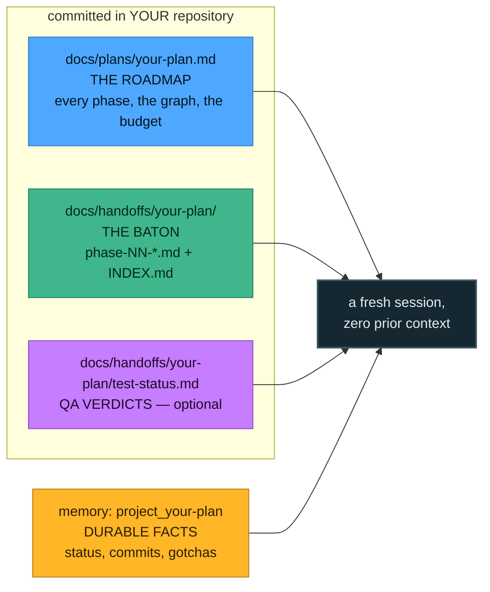

# The artifacts

Four files, one job each. They never duplicate each other, and the same `<slug>` ties them together
so one search finds all of them.

| Artifact | Where | Its one job |
|---|---|---|
| **Plan** | `docs/plans/<slug>.md` | The durable roadmap: every phase, the dependency graph, per-phase detail, exit criteria. Written once, rarely edited. |
| **Handoff** | `docs/handoffs/<slug>/phase-NN-*.md` + `INDEX.md` | The baton for the *next* cold session: state now, files changed, decisions, exact next commands. Written at the end of every phase. |
| **Memory** | `project_<slug>` in your memory index | Durable cross-session facts — status as a *set*, commit shas, gates, gotchas. |
| **QA status** *(opt-in)* | `docs/handoffs/<slug>/test-status.md` + `reports/` | Per-phase verdicts that **gate dependents**. Does not exist unless you turn QA on. |

Plans and handoffs live in **your project repo**, committed and pushed — so any machine or account can
pull and continue. The skill itself stays separate; work-state never goes in the skill folder.

---

