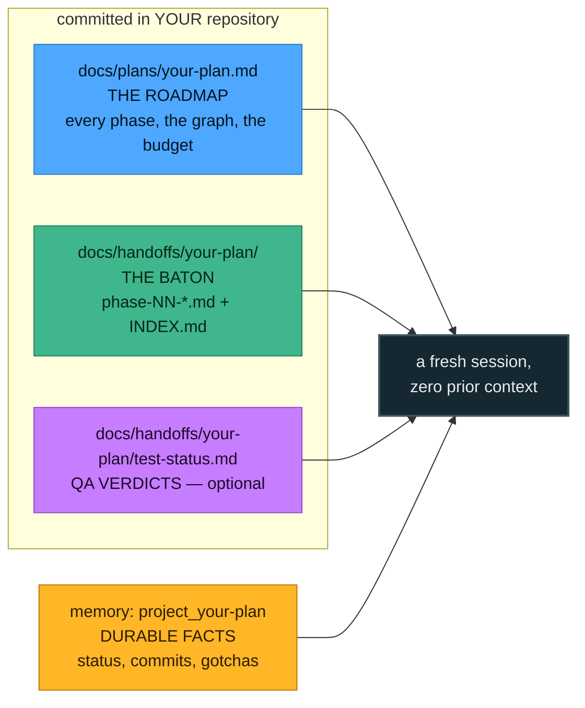

# The artifacts

Four files, one job each. They never duplicate each other, and the same `<slug>` ties them together
so one search finds all of them.



| Artifact | Where | Its one job |
|---|---|---|
| **Plan** | `docs/plans/<slug>.md` | The durable roadmap: every phase, the dependency graph, per-phase detail, exit criteria. Written once, rarely edited. |
| **Handoff** | `docs/handoffs/<slug>/phase-NN-*.md` + `INDEX.md` | The baton for the *next* cold session: state now, files changed, decisions, exact next commands. Written at the end of every phase. |
| **Memory** | `project_<slug>` in your memory index | Durable cross-session facts — status as a *set*, commit shas, gates, gotchas. |
| **QA status** *(opt-in)* | `docs/handoffs/<slug>/test-status.md` + `reports/` | Per-phase verdicts that **gate dependents**. Does not exist unless you turn QA on. |

Plans and handoffs live in **your project repo**, committed and pushed — so any machine or account can
pull and continue. The skill itself stays separate; work-state never goes in the skill folder.

## A plan can be closed

Everything above is *computed*. "Is every phase done?" is read off the handoffs; nothing about it is
stored, so it can never go stale. But there is one question the handoffs cannot answer — **does anyone
still care?** A plan can be perfectly well-formed, half-finished, and dead: the idea was dropped, the
approach was replaced, the product moved. No amount of reading the files reveals that. So it is the one
piece of plan state that *is* stored, in the plan's own frontmatter:

```yaml
status: abandoned            # active | complete | abandoned | superseded
closed: 2026-03-14
closed_reason: replaced by the checkout-rewrite plan
```

A **terminal** status — `complete`, `abandoned` or `superseded` — means the plan is **closed**. Set it
with the script rather than by hand, so the date and the reason land in the right shape:

```bash
scripts/close-plan.sh checkout-rewrite --reason "superseded by the payments rework"
scripts/close-plan.sh checkout-rewrite --status superseded --reason "…"
scripts/close-plan.sh checkout-rewrite --reopen        # back to active, both fields stripped
```

Closing is **reversible by design** — `--reopen` is always available, which is what makes closing a
cheap decision rather than a destructive one. From the console it is the same script behind a dialog
(Close plan / Reopen on the plan page).

**What closing changes: a closed plan stops asking for attention.** No ready phases, no boot prompts,
no batching suggestions, no stuck-handoff or QA-failure or drift warnings, no notifications about work
landing. What it does *not* do is hide anything:

| Closing a plan… | |
|---|---|
| **Stops** | ready phases and boot prompts · session batching · stale-handoff, QA-`fail`, index-drift and stale-lock reports · progress notifications · every portfolio total, the ready queue and the stalled list |
| **Keeps** | the full board, exactly as it was · search results (with a `closed` badge) · genuine structural damage — a malformed row, a missing dependency, a cycle — reported as a note rather than an error |

That split is the whole design. Closing a plan quiets it; it never hides it. "We tried this once and
stopped" is precisely the question a closed plan exists to answer, so it stays findable forever — it
just stops appearing on the surfaces that mean *do something today*.

Two ideas that look alike and must not blur: a closed plan can have unfinished phases, and a plan whose
every phase is done is **still open** until somebody says otherwise. Finishing is about the work;
closing is about the intent.

---

