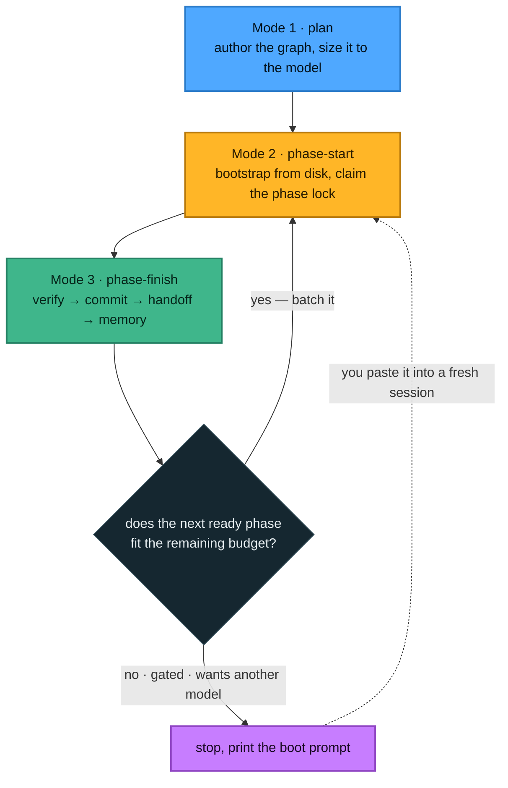

# The loop

Three modes. You never name them; Claude picks the one that matches the situation and says which it
is using.

The important property: **Mode 2 bootstraps from disk only.** A fresh session reads the plan, the
dependency handoffs and the memory entry — and that has to be enough. If it is not, the previous
handoff was deficient, and *that* is the bug to fix.

---

