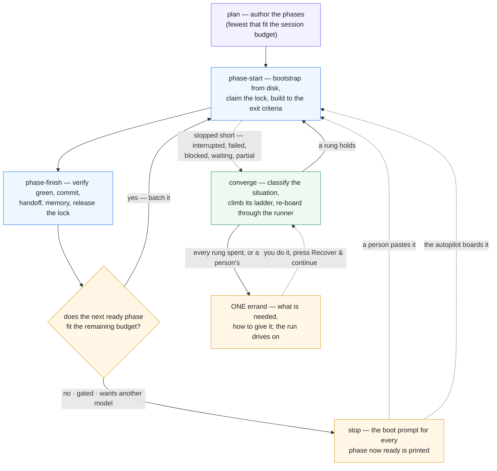

# The loop

> The autopilot's specification. How a plan runs itself, how a stopped phase is *read* rather than
> guessed at, what the machine tries before it asks you, how sessions see each other, and what is
> still — deliberately — a person's. The hand-driven procedure is `SKILL.md`; the console's controls
> are [What you control](controls.md) and [`viewer/README.md`](../viewer/README.md) §The autopilot.
> Everything below names the code that does it, so a claim can be checked against the thing.

## Three modes, one property

A session runs in one of three modes it picks itself: **plan** (no plan exists — author the phases and
start the roots), **phase-start** (bootstrap a phase from disk, claim it, build it), **phase-finish**
(verify, commit, hand off, batch into the next phase or stop). The property the whole system stands on:
**phase-start bootstraps from disk only** — the plan, the dependency handoffs, the memory entry, the
board (`scripts/phase-graph.sh`, the only truth for done / ready / waiting). A fresh session that
cannot start cold from those was handed a deficient handoff, and *that* is the bug to fix.

The dashed edges are what changed in 2.3.0. **Stop is not terminal** any more: a phase that stopped
short is classified and climbed; the boot prompt is still the only author of a fresh boarding
(`phase-graph.sh --boot-prompt`), but the runner may append a brief to it (`resume` · `unblock` ·
`continue` · `closeout`) and may `--resume` the phase's own session instead. The disk-only invariant
therefore holds for the **fresh** brief and is deliberately relaxed for the others — a resumed
session keeps its context on purpose.

## The autopilot in one paragraph

Phase Console's runner (`viewer/server/runner/`) drives a plan with **one unattended `claude -p` per
phase**, the board from `phase-graph.sh`, the §Verification commands from the plan, the handoff from
the session. A session tells the runner how it ended through the **outcome protocol**
(`scripts/phase-outcome.sh` → one JSON file at `PE_OUTCOME_FILE`: `complete` · `blocked` ·
`needs-human` · `waiting-external` · `partial`); prose never counts. The runner verifies, re-reads the
board, and boards whatever is ready next under the scheduler's admission (scopes, locks, usage). Every
automatic act is a journal line on the run (`runs/<instance>/<slug>/run-<id>.jsonl`), bounded by count
**and dollars**, and yields to an operator's Stop. QA is never dispatched by itself. That paragraph was
true before 2.3.0; what follows is what it does when a phase does **not** simply finish.

## Situations — reading a stopped phase

`viewer/server/runner/situation.ts` collects **evidence** for a phase once — the board's word
(`phase-graph.sh --memory-block`), the handoff (`{exists, status, outstanding}`), the run's record
(status, attempts, session, verification, closeout, halt kind), the lock (`phase-lock.sh status`:
owner, host, lease, `session=`, and the registry's presence for it), work in the tree (dirty files,
commits since the attempt), the transcript (turns, cost), a declared outcome, the gate kind, the MCP
preflight, health issues, a live-session hit — and `classifySituation(evidence)` (pure) answers with
**one** of sixteen words. The vocabulary is `viewer/shared/situation-model.js`, imported by the server,
the client and the tests by identity, so a chip, a journal line and an errand can never disagree.

| id | actor | label | it means |
|---|---|---|---|
| `superseded` | none | Superseded | the board reads the phase done; the record is history |
| `qa-failed` | person | QA failed | a recorded `fail` holds the dependents — a verdict is yours |
| `qa-pending` | person | QA pending | the plan gates on QA and none is recorded |
| `foreign-live` | wait | Another session is in it | a LIVE session holds the lock — queue, never fight |
| `foreign-stale` | machine | Stale foreign claim | an expired claim over unfinished work, nobody in it |
| `waiting-external` | wait | Waiting on the outside | the session declared a clock it does not control |
| `gated-manual` | person | Gate needs a person | a `manual` gate, unapproved |
| `plan-broken` | machine | Plan needs repair | lint, an unreadable plan, no runnable §Verification (`:lint` `:unreadable` `:verification` `:<issue>`) |
| `mcp-unavailable` | machine | MCP server unreachable | a server the phase needs did not connect |
| `resource-wall` | machine | Resource wall | `:usage` `:auth` `:budget` `:model` |
| `blocked-declared` | machine | Declared blocked | the handoff says blocked — `:lock` `:credential` `:gate` `:external` `:unknown` |
| `verify-red` | machine | Verification red | the work is there; §Verification is not green |
| `done-unrecorded` | machine | Done, unrecorded | verification green, no complete handoff |
| `work-in-progress` | machine | Work in progress | started, not finished (an `in-progress` handoff, a dirty tree, a `partial`) |
| `never-started` | machine | Never started | no work, no handoff — the session died in bootstrap |
| `unknown` | person | Unclassified | fits nothing above — a person reads the evidence |

The **actor** is the hinge: `machine` has a ladder; `person` gets an errand at once; `wait` settles
itself; `none` is nothing wrong. Classification is journalled as `phase.situation {situation, sub,
label, why[]}` and cached on the record (`PhaseRecord.situation {key, at, why}`) for the table and the
Ways-forward strip. The diagnosis endpoint (`GET /api/run/:slug/diagnosis/:phase`) returns the
situation with the evidence lines it read.

## The ladder — what the machine tries before it asks

`viewer/server/runner/ladder.ts` climbs; the **table** is `viewer/shared/ladder-model.js`
(`RUNGS_BY_SITUATION`), so the client shows the same rungs in the same words. Per situation, an
ordered list of **rungs** — a vehicle plus parameters — climbed in order, **never the same rung twice
for one situation on one phase**, and bounded by the caps below. A rung's record is pushed *before*
the spend (`accountRung`: `phase.rung {situation, rung, params, brief, vehicle, attempt}`) and settled
when the session ends (`settleRung`: `fixed` · `no-defect` · `superseded` · `failed`), so a console
that dies mid-rung still remembers it tried.

| situation | rungs, in climb order (→ an errand at the end) |
|---|---|
| `never-started` | **Re-board fresh** (the engine's boot prompt; the record resets to pending) |
| `work-in-progress` | **Continue in its own session** (`--resume`, "you are RESUMING — read git status first") → **Board fresh with a resume brief** → **Board fresh, stronger** (next model/effort) |
| `done-unrecorded` | **Finish in its own session** (verify, commit, handoff — nothing else) → **Close out with a new agent** |
| `verify-red` | **Resume with the failure** (the failing commands and their output) → **Fix with a stronger new agent** |
| `blocked-declared:lock` | **Queue behind the lock** (woken by the docs watcher, the lease, the idle poll) |
| `blocked-declared:external` | **Park and poll the refs** → **Park for a while** |
| `blocked-declared:unknown` | **One bounded unblock session** — the own session (or a fresh one with an unblock brief) carrying the Outstanding text, explicitly allowed to do the work |
| `blocked-declared:credential` / `:gate` | — (a person's: the errand at once) |
| `resource-wall:usage` | **Switch to an account with headroom** → **Switch model** → **Wait for the window** |
| `resource-wall:auth` | **Switch to a signed-in account** |
| `resource-wall:budget` | **Raise the budget once** (within the policy cap) |
| `resource-wall:model` | **Wait for the first model's window** |
| `mcp-unavailable` | **Wait for the server** (the `require` park's clock) → **Continue without it** |
| `plan-broken` | **Deterministic repair** (`scripts/repair-artefacts.sh` — not yet written; the rung is skipped) → **Repair the plan with a new agent** |
| `foreign-stale` | **Take over the stale claim** → then the work-in-progress ladder |
| `waiting-external` | **Re-check what it waits on** |
| `foreign-live` · `gated-manual` · `qa-*` · `superseded` · `unknown` | — (queue · errand · errand · nothing · errand) |

**Caps** (`nextRung` refuses with a sentence; every one is a preference in Settings ▸ Automation):
3 rungs **and** $100 per phase (`ladderPerPhaseRungs`, `ladderPerPhaseUsd`) · 10 and $400 per run
(`ladderPerRunRungs`, `ladderPerRunUsd`) · $600 per day per console (`ladderPerDayUsd`). Why dollars
as well as counts: the old healer counted launches, and a $40 session followed by two $6 closeouts and
a $20 console closeout was "within budget".

**Briefs.** A rung that re-boards sets a `boardingHint {situation, rung, brief, sessionId?,
instruction?, escalate?}` on the record; boarding reads it once and assembles the prompt: `fresh` is
the engine's boot prompt alone; `resume` appends the resume brief (SKILL.md Mode 2 "RESUMING" plus the
evidence — the handoff's status, the uncommitted paths, the last verification, the session's last
words); `unblock` appends the handoff's Outstanding text and the permission to do the work; `continue`
and `closeout` are instructions to the phase's **own** session (`claude -p --resume`). The engine's
boot prompt is never rewritten — `phase-graph.sh --boot-prompt` stays the only author.

**The errand.** When the ladder is exhausted — or the situation was a person's to begin with — the
phase is parked with **one** `Errand {phase, situation, tried[], need, how, at}` (`errandFor`, the
`need`/`how` word-book in `ladder.ts`): what is needed, how to give it, and what the autopilot already
tried so nobody repeats it by hand. Journalled as `phase.errand` (or `run.errand` for a wall with no
phase), announced once under the `needs-you` push category, shown on every Ways-forward surface, the
run's banner and the dashboard's **Waiting on you**. **The run keeps driving everything else** — it
halts only when nothing can proceed. `failure-streak` counts ladder exhaustions, not attempts.

## Convergence — it keeps looking

`viewer/server/converge.ts`: `planConvergence(facts)` (pure) decides, `executeConvergence` acts,
`ConvergeScheduler` runs them. **Triggers:** at boot · on a docs change (2 s debounce) · every
`convergeEveryMs` per open plan (default 5 min, floor 30 s, 0 = timer off) · 60 s after any halt · on
**Recover & continue** (the `recover` verb). **One pass, in order:**

1. **Reconcile-close** — records the board has overtaken flip to `done` ("closed outside this run");
   halts anchored to them dissolve. Reconcile *closes*, never re-runs (CLAUDE.md).
2. **Classify** every non-done phase of the plan's latest run (the situation above).
3. **Climb** for runs stopped **not by the operator** — `parked` / `halted` / `interrupted`, or paused
   by the system (`stoppedBy: 'system'`, a console shutdown); never a run a person paused or stopped,
   never a `resolved` one. The ladder's rung is driven **through the runner** —
   `startRun({resumeRunId, reboard: [{phase, situation, rung}]})` resets the records to `pending` with
   a `boardingHint` — never a second orchestration beside it.
4. **Release lock debris** — locks held by runs this console knows are dead, or by a session the
   registry shows **ended**; journalled `run.lock-debris-released`.
5. **Re-arm** lock-cap parks whose lock is gone (`phase.lock-cap-rearmed`).
6. **Resume at boot** the lanes a restart killed — their own session, `phase.resume-at-boot`, at most
   `MAX_BOOT_RESUMES` (3) in a row per phase, then an errand (`resumeAtBoot` preference).
7. **Health** — records ahead of the board surface as a health issue, not a silent contradiction.

A pass that healed nothing remembers its fingerprint and does not run the healer again until something
changes; the operator's press always asks afresh. The pass is journalled as `run.converge {trigger,
action: relaunch|heal, why, reboard[], rearm[], launched, phase, situation, rung}` (or
`run.converge-failed`), and the flattened report rides the event stream as **`run:converge`** and
answers `GET /api/converge` (`{automatic, everyMs, pending[], running[], reports[]}`) — the Pulse's
**Converge** line ("re-boarded P12 (Never started → Re-board fresh) · released a stale claim on P3")
is that view, and the `#/pulse` page states whether the loop runs by itself on this console.
`--no-converge` keeps the automatic passes off while Recover & continue still works; a console without
`--allow-run` never converges (it cannot start anything).

## Resource walls — the ladder at the top of the run

Walls that used to stop a run for a person climb their first rung inline in the runner
(`viewer/server/runner/runner.ts`), each behind its preference with the default **on**:

- **Auth** — the run's account fails the preflight: the ranked candidates (`Accounts.rankAccounts`)
  are *probed* and the first that signs in takes the run (`run.account-switched`); none → the
  `run-preflight` park with an errand naming the sign-in (`autoAccountSwitch`).
- **Usage window past the 12 h ceiling** — under `onLimit: wait` the switch is tried first; with no
  account to pay, the run waits on the window itself (restart-safe; `run.waiting`); `pause` keeps its
  word (`autoAccountSwitch`).
- **Models exhausted** — the first model's reset is waited for once (`phase.model-window-wait`), then
  the same session retries on it; no reset inside 12 h → the `models-exhausted` halt as before.
- **Budget** — a spent run budget is raised **once** by `budgetAutoRaisePct` (25 %) within the ladder's
  per-run USD cap (`run.budget-raised`, `state.budgetRaise`); the second exhaustion halts `budget` with
  the errand.
- **PR pending** — on a work-branch run the last done leaf's own session is resumed to open the PR;
  only when none can be resumed does the branch end "awaiting its PR".
- **MCP `require`** — the park carries its clock (`record.mcpPark`); after `mcpRequireTimeoutMs`
  (30 min; 0 = wait forever) the phase continues without the servers under its own `continue` policy,
  the errand recorded, the operator told once (`phase.mcp-require-timeout`); a server that heals
  sooner requeues it sooner.

## Presence and sync — sessions that see each other

**The hook.** `scripts/session-hook.sh` is a user-scope Claude Code hook for `SessionStart`, `Stop`
(the per-turn heartbeat) and `SessionEnd` (hooks fire in `-p` too, merged with the per-run
`--settings` hooks). Fail-open, always exit 0, 2 s timeout, `PHASE_CONSOLE_HOOK_OFF=1` is a no-op. It
reads the payload on stdin (64 KiB cap; the first occurrence of each field wins, so a quoted payload
inside `last_assistant_message` cannot spoof `cwd` or `session_id`; both the CLI's `source`/`reason`
and the documented `session_start_reason`/`session_end_reason` spellings are read), resolves the
console that owns `cwd` (`viewer/shared/instances.mjs shell --cwd`, like `bin/btw`; `PHASE_CONSOLE_URL`
overrides), and POSTs one JSON line — `{version, session_id, event, cwd, transcript_path, source,
reason, owner: $PE_OWNER, scope: $PE_SCOPE, user, host, pid, root, at}` — to `POST /hooks/session`
(loopback only; a request through the `--remote` proxy is 403 — forged presence from a phone could
release a real lock). A console that is down gets the record in `INSTANCE_STATE_DIR/sessions/inbox/`
and drains it on the next boot. At SessionStart it prints `additionalContext` telling the session its
own id and to pass `--session <id>` (or that the runner already exported `PE_SESSION_ID`). **Installed**
from Settings ▸ Session presence or `phase-console install-hooks` / `uninstall-hooks` / `hooks-status`
(`viewer/server/hooks-install.ts`): it rewrites only the `hooks` value's byte span in
`~/.claude/settings.json` — every other byte, key order, indent and EOL kept; idempotent; an entry
pointing at another checkout is refreshed in place; an unparseable file is refused.

**The registry.** `viewer/server/sessions/registry.ts` folds the events into `SessionRecord {sessionId,
kind: autopilot|agent|foreign, cwd, root, transcript, owner, scope, user, host, pid, startedAt,
lastSeen, endedAt, reason, turns}` and answers **presence** in three values: **`ended`** (SessionEnd
seen, or the recorded `claude` pid is gone), **`live`** (seen within 24 h and nothing says otherwise),
**`unknown`** (nobody reports it — an un-hooked machine, a lock with no `session=`). `GET
/api/sessions/registry` lists them with the plan and phase they work; the SSE `sessions` event carries
the `foreign` list; the Pulse draws live ones as lanes of their own kind (Terminal session · Console
agent · Autopilot session) and the `#/pulse` page lists the rest under *Other sessions*.

**The lock names its session.** `phase-lock.sh claim` writes `session=<id>` from `--session`,
`$PE_SESSION_ID` (runner-injected — `spawn.ts` mints the id before the child exists and passes the same
value as `--session-id`) or `$CLAUDE_CODE_SESSION_ID`. **Correlation** is strong when a lock's
`session=` is a registered id, weak (display only — the Pulse says "probably") when only
`<user>@<host>` and time match. **What each reader does:** a lock whose session is `ended` is **debris
now**, whatever the lease says — the scheduler admits the phase queued behind it, the boarding
belt-check releases it and boards, the convergence loop releases the file; a lock held by a `live`
session reads `foreign-live` (queue, never fight, re-evaluate on the next presence change); `unknown`
falls back to the lease rules. Nothing ever releases on a weak match.

**Human sessions' outcomes.** `phase-outcome.sh` in a session nobody supervises (no `PE_OUTCOME_FILE`)
writes the same declaration into the console's inbox — `~/.local/state/phase-console/runs/<instance>/
<slug>/outcomes/phase-NN.json` (the instance id `sha256(root)[:8]-basename`, `scripts/instance.sh`) —
and a running console with `--allow-run` picks it up: a live runner for the plan declares it through
`Runner.declareOutcome` (`phase.outcome {by:'unsupervised'}`); with no live runner the service edits
the plan's latest run (or creates one, `run.start {by:'unsupervised'}`). `waiting-external` parks the
phase `waiting` and resumes **that** session at the window; **`partial --reason budget|context|other`**
("work remains, resume me") re-boards it with a resume of that session; `blocked` / `needs-human` /
`complete` are kept as declared evidence and announced once. A declaration older than 24 h is history.

## What is still a person's

The autopilot asks **once, with a named errand**, only here: a **sign-in** (no session can give it);
a **`manual` gate** (numbered steps on the Gate card, Approve or `gate-approve.sh`); a **credential** a
session named and none holds; an approval or sign-off the session said it waits for; a **blocker no
machine category fits** after its one unblock session; **QA** (a verdict is a press — the autopilot
never spawns reviewers on its own); **destructive or irreversible acts** and **publishing** (push, tag,
release — the deny list holds them on every profile); and anything `unknown`. Everything else it decides,
within the caps, and journals.

## The journal, by name

| line | who | when |
|---|---|---|
| `phase.situation {situation, sub, label, why}` | runner, healer | every classification |
| `phase.rung {situation, rung, params, brief, vehicle, attempt}` · `phase.rung-settled {rung, outcome}` | runner, healer | a rung climbed / settled |
| `phase.ladder-skipped` · `phase.ladder-deferred {remaining}` | runner | auto-recovery off for the run / a rung this console cannot drive yet |
| `phase.errand {…errand, label, reason}` · `run.errand` | runner, healer, converge | the one ask |
| `phase.reboard-requested {situation, rung, brief, sessionId}` · `phase.resume-at-boot` | runner, converge | a re-board by rung / a killed lane resumed |
| `run.converge {trigger, action, why, reboard, rearm, launched, phase, situation, rung}` · `run.converge-failed` | converge | a pass acted |
| `run.lock-debris-released {phase, owner, session?, why}` · `phase.lock-debris-released {by:'boarding'}` · `phase.lock-cap-rearmed` | converge, boarding | debris released / a lock wait re-armed |
| `run.account-switched` · `phase.account-switch` · `run.waiting` · `phase.model-window-wait` · `phase.model-window-retry` · `run.budget-raised` · `phase.mcp-require-timeout` · `phase.pr-session` | runner | the resource walls |
| `phase.outcome {status, reason, resumeAfter, watch, by?}` · `phase.outcome-ignored` · `phase.outcome-partial` · `run.start {by:'unsupervised'}` | runner, service | outcomes, a hand session's included |
| `run.plan-recover {step}` | service | Recover & continue's three steps |

## The knobs (Settings ▸ Automation, `POST /api/prefs`, `server/config.ts`)

| key | default | means |
|---|---|---|
| `autoRecoverByDefault` | on | new runs opt into the ladder (`run.autoRecover`) |
| `autoContinueRecovery` | on | a run resumes by itself when a recovery leaves the board fixed |
| `ladderPerPhaseRungs` / `ladderPerPhaseUsd` | 3 / 100 | the per-phase caps |
| `ladderPerRunRungs` / `ladderPerRunUsd` | 10 / 400 | the per-run caps |
| `ladderPerDayUsd` | 600 | the per-console-day cap |
| `convergeEveryMs` | 300 000 | the sweep (0 = timer off; boot, change and post-halt passes stay) |
| `unblockAttempts` | on | one bounded unblock session on a `blocked-declared:unknown` |
| `staleClaimTakeover` | on | take over an expired foreign claim over unfinished work |
| `resumeAtBoot` | on | resume the lanes a restart killed |
| `autoAccountSwitch` | on | switch accounts at an auth or a far usage wall |
| `budgetAutoRaisePct` | 25 | the one budget raise (0 = never) |
| `mcpRequireTimeoutMs` | 1 800 000 | a `require` park's clock (0 = wait forever) |
| `mcpPolicy`, `gitMode`, `openPrOnComplete`, `repoGuard`, `attachDefaultSkills`, `qaByDefault` | — | the launch defaults ([controls.md](controls.md)) |

## Where it lives

`viewer/shared/{situation-model,ladder-model,recovery-model}.js` (the vocabularies, imported by
identity) · `viewer/server/runner/{situation,ladder,runner,scheduler,spawn,outcome}.ts` ·
`viewer/server/{converge,service,hooks-install}.ts` · `viewer/server/sessions/registry.ts` ·
`scripts/{session-hook,instance,phase-lock,phase-outcome}.sh` · the client's
`components/{errand,recovery-actions,pulse}.tsx`, `views/dashboard/now.tsx`,
`views/settings/{automation,ladder,hooks}.tsx` · tests: `viewer/test/{situation,ladder,converge,
auto-recovery,sessions-*,hooks-install}.test.ts` and `tests/unit/{session-hook,lock,outcome}.bats`.

---
