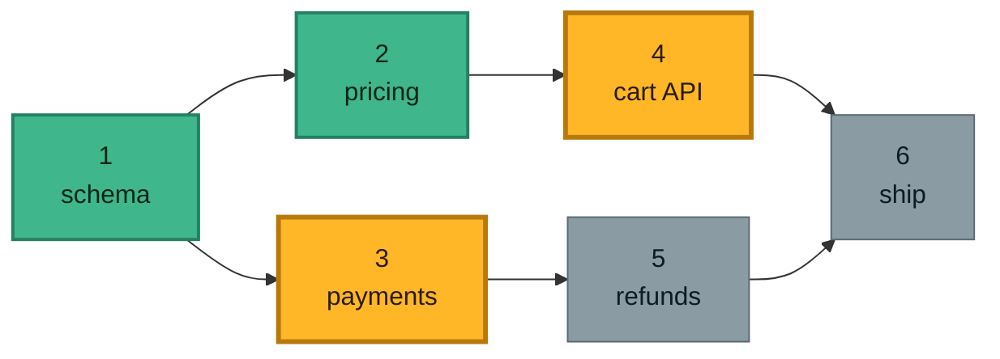

# What problem this solves

A big change does not fit in one Claude session. So you split it — and immediately pay for the split
twice.

**Long sessions rot.** As the context window fills, a model's recall and precision degrade. The last
third of a very long session is measurably worse work than the first third. You do not get a warning;
you just get sloppier code.

**Short sessions are expensive in a different currency.** Every fresh session has to find its footing
again: read the plan, read what the last session did, re-explore the code. That bootstrap is a fixed
tax, and chopping work into many tiny sessions pays it over and over. It also throws away the prompt
cache, which is what makes a warm session cheap.

```
    one long session   ███████████████████████████████████
                       └────────── quality decays in the tail ──────────┘

  many tiny sessions   ███▏███▏███▏███▏███▏███▏███▏███▏███
                       ▏ = a full bootstrap + closeout, paid every single time

         right-sized   ██████████▏██████████▏██████████
                       enough work to amortise ▏, few enough ▏ to stay sharp
```

**And you lose the thread.** Once work spans a dozen sessions, "which piece is next?" stops being
obvious. Piece 7 might be ready while pieces 2 and 3 are still open. A note that says *"currently on
phase 5"* goes stale the moment you finish something out of order — and then you build on a base that
was never finished.

## The three real levers

Contrary to the common belief that long sessions cost quadratically, Claude Code caches the
conversation prefix, so a warm session is roughly **linear** in turns. The things that actually hurt:

| Lever | What it is | What this skill does about it |
|---|---|---|
| **Context rot** | quality degrades as the window fills — usually bites long before cost does | sizes every session to ~60% of the window, so no session runs into the bad zone |
| **Cache-busting** | switching model, changing effort, `/compact`, a >5-min idle gap — each forces a full-price re-read | makes a model switch an explicit session boundary; discourages mid-phase `/compact` |
| **Bootstrap tax** | each fresh session re-reads plan + handoff + code before it can do anything | batches adjacent work into one session so the tax is paid once, not five times |

---

# The idea in one picture

Work is a **dependency graph**, not a checklist. Each phase declares which phases must finish before
it can start. Then one rule decides everything:

> **A phase is `ready` when it has not been started and *every* dependency is `done`.**

Readiness is computed from the set of finished phases — never from a counter. That single choice is
what makes out-of-order and fan-out progress safe.



Phases **1** and **2** are done. That makes **3** ready *(its only dependency, 1, is done)* and **4**
ready *(its only dependency, 2, is done)* — one finished phase unblocked two. **5** and **6** wait,
because a dependency of each is still open.

Two consequences worth internalising:

- **Finishing a phase can unblock several.** Pick whichever you like. Whether two of them may run **at
  the same time** depends on their **scope** — the repos each touches, from the plan's Repos column.
  Disjoint scopes go in parallel; anything sharing a repo runs one at a time, because two Claude
  sessions in one working tree overwrite each other mid-edit.
- **"Finished" means every phase is done**, not "we reached the highest number". You can complete
  1 → 4 → 6 and the board will still, correctly, show 3 and 5 as unfinished.

---

