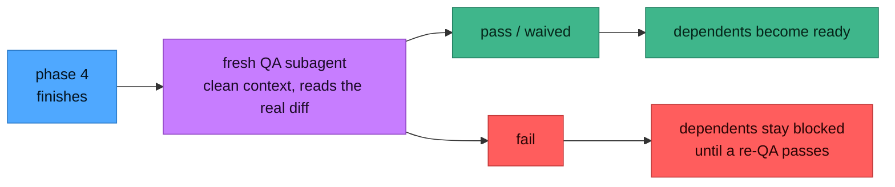

# QA gating

QA here is not a report you read afterwards. It is a **gate**: with it on, a phase's dependents are
not allowed to start until that phase is verified. That is the whole point — a broken phase should not
silently propagate into everything built on top of it.



**Turning it on.** Ask for it at plan time and the plan records `**QA gate:** on`. Ask for it later
and the next phase-finish picks it up. Check which regime a plan is in:

```bash
scripts/phase-graph.sh checkout-rewrite --qa-mode      # off | on <reason> | waived <reason>
```

**Why a *fresh* subagent.** The session that built the phase shares the blind spots of the code it
just wrote. QA runs in a subagent with a clean context that reads the real diff cold — it verifies
commits against `git show` rather than trusting the handoff's summary, checks every exit criterion,
sweeps for correctness, edge cases, error handling, regressions and security, and runs the tests. A
suite that is green but does not actually cover the criteria is a **fail**, not a pass.

**The verdicts.**

| Verdict | Meaning | Effect on dependents |
|---|---|---|
| `pass` | every exit criterion met with evidence, tests green, no high/critical findings | released |
| `fail` | a criterion unmet, a high/critical finding, or red tests | **held** until a re-QA passes |
| `waived` | genuinely not applicable, justified explicitly | released |
| `pending` | recorded but not yet judged | held |

On a fail, the QA subagent does **not** fix the code — it returns the verdict and enumerates the
follow-ups. The finishing session owns the fix, and re-QA is always a *new* fresh subagent, never a
re-run inside the one that failed. Results are committed and pushed so the gate reaches every clone.

Verdicts are recorded only through `scripts/qa-record.sh` — an idempotent upsert. Never hand-edit
`test-status.md`.

## A recorded `fail` outlives the switch

Turning QA off does **not** clear one. Once `test-status.md` exists — on any plan, old or new — the
gate binds: a `fail` holds every dependent until a re-QA passes, and flipping the plan back to
`**QA gate:** off` changes nothing about the row. That is deliberate. A failure you can dismiss by
turning off the thing that found it is not a gate.

Which leaves an obvious question: **what about a plan you are never going to finish?** A dropped
experiment with a red phase 3 would otherwise report a failure at you forever, and re-QA'ing work
nobody wants is a strange price to pay for silence.

**Closing the plan is the answer** — and it is a different answer, not a loophole:

```bash
scripts/close-plan.sh checkout-rewrite --reason "approach dropped after the spike"
```

A QA failure is a statement about **progress**, and a closed plan makes no claims about progress, so
its verdicts stop being reported. Nothing is erased: the row stays in `test-status.md`, the phase still
reads failed on the board, and search still finds all of it. Reopen the plan and the gate is exactly
where you left it, still holding.

So the two exits are not interchangeable, and it is worth being precise about which one you want:

| | What it means | What it takes |
|---|---|---|
| **Re-QA** | the work is now correct | a fresh subagent, a passing verdict |
| **Close** | the work no longer matters | a status and one line saying why |

Re-QA is how you *clear* a failure. Closing is how you stop *caring* about one. Neither pretends the
other happened.

---


## Turning QA on from the console

The console offers QA at every launch surface: a "QA gate" toggle on the run form and the phase
launcher, an activation checkbox on the review dialog, and a **QA by default** preference
(Settings ▸ Automation) that pre-ticks them for every plan. Launch-time activation goes through the
skill's own `--qa` path — it needs the console started with `--allow-writes` (activation writes
`test-status.md`), refuses loudly when it isn't, and backfills every already-finished phase as
`waived` so turning it on never retroactively holds the board.

One behaviour worth knowing before ticking it on a big plan: activation is plan-wide and sticky, and
a run started under QA **parks at QA boundaries** until verdicts are recorded — the autopilot does
not spawn reviewers on its own. Reviews come from the console's QA dialog (or a hand-dispatched
subagent), and the run continues once the verdict lands.
